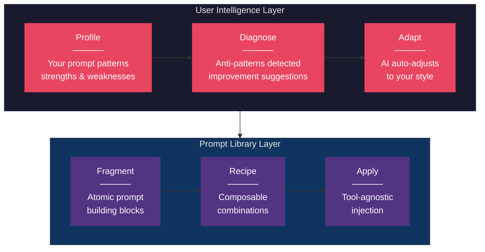
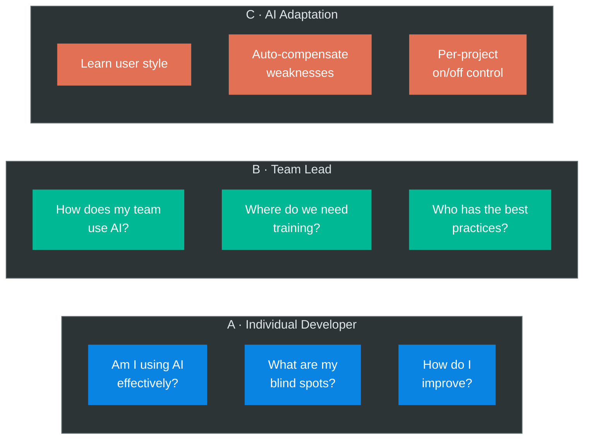
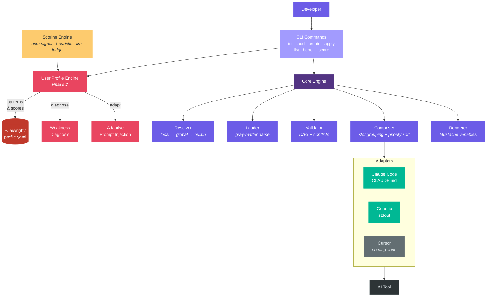
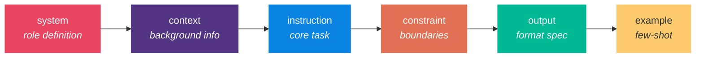
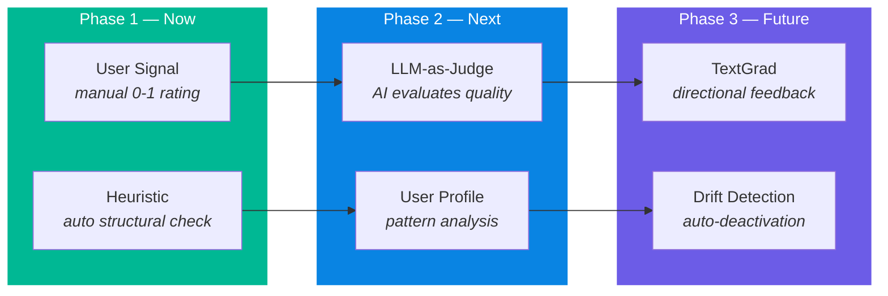

<div align="center">

# aiwright

### AI Usage Intelligence Framework

**Understand how you use AI. Improve how AI works for you.**

[](LICENSE)
[](https://nodejs.org)
[](https://typescriptlang.org)
[](#testing)

[Quick Start](#-quick-start) &#8226;
[Architecture](#-architecture) &#8226;
[User Intelligence](#-user-intelligence) &#8226;
[Prompt Library](#-prompt-library) &#8226;
[CLI Reference](#-cli-reference) &#8226;
[Contributing](CONTRIBUTING.md)

</div>

---

## The Problem

AI coding assistants are only as good as the prompts they receive. But:

> **You don't know what you don't know.**

- You can't measure how well you're using AI
- You repeat the same ineffective patterns without realizing
- Your team has no shared standard for AI interaction
- When AI gives bad output, you don't know if it's the AI or your prompt

## The Solution

**aiwright** is a two-layer framework:



**Layer 1 — User Intelligence**: Profiles your AI usage patterns, diagnoses weaknesses, and adapts AI behavior to your style.

**Layer 2 — Prompt Library**: Composable prompt fragments that you can mix, match, measure, and share via npm.

---

## Who is this for?



---

## Quick Start

```bash
npm install -g @jsnetworkcorp/aiwright

cd your-project
aiwright init --adapter claude-code --with-builtins
aiwright apply default
aiwright score default --set 0.85 --note "works well"
```

<details>
<summary><b>See it in action</b></summary>

```
$ aiwright init --adapter claude-code --with-builtins

✔ Created aiwright.config.yaml
  Adapter: claude-code
✔ Created .aiwright/fragments/
✔ Created .aiwright/scores/
✔ Created .aiwright/manifest.yaml

Copying built-in fragments:
  + constraint-concise.md
  + constraint-no-hallucination.md
  + output-json.md
  + output-markdown.md
  + system-role-engineer.md

aiwright initialized successfully!

$ aiwright apply default

✔ Applied recipe default
  → CLAUDE.md
  Applied to CLAUDE.md via aiwright markers
```

</details>

---

## Architecture



---

## User Intelligence

> **Phase 2** — Coming soon. The prompt library (below) is available now.

### A · Personal Profile

aiwright tracks how you interact with AI and builds your usage profile:

| Dimension | What it measures | Example insight |
|-----------|-----------------|-----------------|
| **Specificity** | How precise your instructions are | _"Your prompts are 2x more vague than average"_ |
| **Context Ratio** | How much context you provide | _"You over-provide context, wasting 40% of tokens"_ |
| **Constraint Usage** | Whether you set boundaries | _"You rarely use constraints — AI hallucinates more"_ |
| **Domain Mastery** | Success rate by task type | _"Code review: 85%, Architecture: 40%"_ |
| **Growth Trend** | Improvement over time | _"Your debugging prompts improved 15% this month"_ |

### B · Team Dashboard

```
┌─────────────────────────────────────────────────────┐
│  Team AI Capability Dashboard                       │
├──────────┬───────┬─────────┬──────────┬────────────┤
│ Member   │ AIQ   │ Top     │ Weakness │ Trend      │
├──────────┼───────┼─────────┼──────────┼────────────┤
│ Alice    │  87   │ Review  │ Arch.    │ ↑ +5       │
│ Bob      │  72   │ Debug   │ Docs     │ → stable   │
│ Carol    │  91   │ Arch.   │ —        │ ↑ +3       │
├──────────┴───────┴─────────┴──────────┴────────────┤
│ Team avg: 83  │  Common gap: Documentation         │
└─────────────────────────────────────────────────────┘
```

### C · Adaptive AI

Based on your profile, aiwright can automatically adjust how AI responds:

```yaml
# Auto-generated based on your profile
# aiwright detects: "user tends to give vague instructions"
# aiwright injects: constraint fragment to compensate
adaptive:
  enabled: true
  compensations:
    - when: "specificity_score < 0.5"
      inject: constraint-be-specific
    - when: "domain == 'architecture'"
      inject: architecture-checklist
```

---

## Prompt Library

The foundational layer — composable prompt management.

### Core Concepts

<table>
<tr>
<td width="33%">

**Fragment**
_Atomic prompt unit_

```markdown
---
name: no-hallucination
slot: constraint
priority: 50
---

Do not generate unverified
information. Say "I'm not
sure" when uncertain.
```

</td>
<td width="33%">

**Recipe**
_Fragment composition_

```yaml
recipes:
  default:
    fragments:
      - fragment: system-role
      - fragment: no-hallucination
      - fragment: output-markdown
```

</td>
<td width="33%">

**Adapter**
_Tool-specific bridge_

```
claude-code → CLAUDE.md
cursor      → .cursorrules
copilot     → copilot-instructions
generic     → stdout
```

</td>
</tr>
</table>

### Slot System

Fragments are inserted into **slots** — structural positions within the prompt:



Within each slot, **priority** (0-999) controls ordering. Lower = first.

### Built-in Fragments

| Fragment | Slot | Description |
|----------|------|-------------|
| `system-role-engineer` | system | Software engineer role with `{{role}}` variable |
| `constraint-no-hallucination` | constraint | Prevent fabricated information |
| `constraint-concise` | constraint | Encourage focused responses |
| `output-markdown` | output | Markdown formatting rules |
| `output-json` | output | JSON output structure |

### Hierarchical Override

```
Priority (highest wins):
╔══════════════════════════════════════╗
║  Project    .aiwright/fragments/     ║  ← Your project's fragments
╠══════════════════════════════════════╣
║  Global     ~/.aiwright/fragments/   ║  ← Your personal defaults
╠══════════════════════════════════════╣
║  Built-in   (package)               ║  ← aiwright defaults
╚══════════════════════════════════════╝
```

---

## CLI Reference

| Command | Description |
|---------|-------------|
| `aiwright init` | Initialize project (auto-detect adapter, optional builtins) |
| `aiwright add <name>` | Add a fragment from builtins or local file |
| `aiwright create` | Create a new fragment with `--name`, `--slot`, `--body` flags |
| `aiwright apply <recipe>` | Apply recipe to AI tool (`--dry-run`, `--diff`) |
| `aiwright list` | List fragments and recipes (`--search`, `--format json`) |
| `aiwright bench <recipe>` | Run benchmark cases (`--cases`, `--save`) |
| `aiwright score <name>` | Record or view quality scores (`--set`, `--trend`) |

<details>
<summary><b>Detailed CLI examples</b></summary>

### Init

```bash
# Auto-detect adapter + copy built-in fragments
aiwright init --adapter claude-code --with-builtins
```

### Create a custom fragment

```bash
aiwright create \
  --name nextjs-conventions \
  --slot context \
  --priority 20 \
  --body "This project uses Next.js 15 App Router.
Use Server Components by default.
Mark Client Components with 'use client'."
```

### Apply to CLAUDE.md

```bash
aiwright apply default          # Apply recipe
aiwright apply default --dry-run  # Preview without writing
```

Result in CLAUDE.md:
```markdown
<!-- aiwright:start -->
You are a senior software engineer.
...
Do not generate unverified or fabricated information.
...
Format your responses using Markdown.
...
<!-- aiwright:end -->
```

### Measure quality

```bash
aiwright score default --set 0.85 --note "works well"
aiwright score default --trend    # ASCII chart over time
```

### Benchmark

```bash
aiwright bench default --cases bench/cases.yaml --save
```

</details>

---

## Configuration

```yaml
# aiwright.config.yaml
version: "1"
adapter: claude-code

vars:
  language: TypeScript

recipes:
  default:
    description: Standard development prompt
    fragments:
      - fragment: system-role-engineer
        vars: { role: "senior TypeScript developer" }
      - fragment: constraint-no-hallucination
      - fragment: output-markdown
```

---

## Adapters

| Adapter | Target File | Status |
|---------|-------------|--------|
| **claude-code** | `CLAUDE.md` | Available |
| **generic** | stdout | Available |
| cursor | `.cursorrules` | Phase 5 |
| copilot | `copilot-instructions.md` | Phase 5 |
| windsurf | `.windsurfrules` | Phase 5 |

---

## Scoring



---

## Roadmap

- [x] **Phase 1**: Prompt Library — Fragment/Recipe, CLI, Claude Code Adapter, Scoring
- [x] **Phase 2a**: Profile Engine — 6-axis Style, Prompt DNA, Linter (8 rules), Weakness Diagnosis
- [x] **Phase 2b**: Behavior Analysis — PCR/FTRR metrics, Adaptive AI, Linter (4 rules)
- [ ] **Phase 2c**: Visualization & Team — Skill Tree, Prompt Kata, Team Dashboard, Git AI-Trace
- [ ] **Phase 3**: Drift Detection — TextGrad directional feedback, Auto-deactivation
- [ ] **Phase 4**: Multi-Adapter — Cursor, Copilot, Windsurf
- [ ] **Phase 5**: Advanced — Bayesian Optimization, Dual Evolution

---

## Academic Foundation

Built on research from leading AI labs:

| Mechanism | Reference | Application |
|-----------|-----------|-------------|
| Structured prompt sections | MPO (arXiv:2601.04055) | Fragment slot system |
| Directional feedback | TextGrad (arXiv:2406.07496) | "Which fragment hurts quality?" |
| Combination search | MIPROv2 (Stanford NLP) | Optimal fragment composition |
| Performance history | OPRO (ICLR 2024) | Score-based improvement |
| Self-healing agents | VIGIL (arXiv:2512.07094) | Drift detection & recovery |

---

## Testing

```
12 test files · 165 test cases · all passing
```

```bash
npm test              # Run all tests
npm run test:watch    # Watch mode
npm run test:coverage # Coverage report
```

---

## Contributing

We welcome contributions! See [CONTRIBUTING.md](CONTRIBUTING.md) for guidelines.

```bash
git clone https://github.com/tomtomjskim/aiwright.git
cd aiwright && npm install && npm test
```

---

## License

[MIT](LICENSE) — Made with care by [JSNetworkCorp](https://github.com/jsnetworkcorp)
