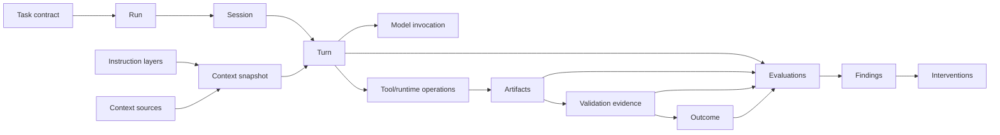

# AIwright Platform RFC — adversarial review

> **Review date:** 2026-08-21  
> **Target:** PRD v0.1, benchmark and gated roadmap  
> **Disposition:** Product thesis is viable, but implementation remains blocked on protocol and privacy decisions below.

## 1. Executive verdict

The proposed platform has a credible boundary only if it evaluates **validated task outcomes across sessions** rather than assigning prompt-quality scores to individuals.

The RFC correctly avoids immediate dashboard/SaaS work, but four unresolved areas can still invalidate the product:

1. context provenance and model visibility;
2. low-friction task/outcome declaration;
3. trustworthy evidence and task comparability;
4. privacy guarantees that survive raw CLI/tool content.

These are protocol-level constraints. They cannot be repaired later by UI copy.

## 2. Findings

### AR-01 — Context is not yet a first-class object

**Severity:** Critical  
**Status:** Accepted; Protocol v0.1 blocker

A user prompt is only one instruction layer. Codex or another agent may also receive:

- system/developer instructions;
- repository `AGENTS.md` or equivalent rules;
- user profile or memory;
- task-plan artifacts;
- skills and prompt fragments;
- selected files, diffs, retrieval results, or attachments;
- tool output;
- conversation history;
- compacted/summarized history;
- child-agent task messages;
- provider-side cached context that is reported only partially.

Without recording which context source was active and whether it was model-visible, AIwright can falsely blame the user for missing information or fail to identify stale/contradictory instructions.

#### Required protocol additions

Introduce at least:

| Entity | Purpose |
|---|---|
| `instruction_layer` | System, developer, project, skill, task, user, tool, or other instruction source with precedence and version. |
| `context_snapshot` | The context configuration associated with one run/turn, including known source references and hashes. |
| `context_source` | File, message, memory, retrieval result, attachment, policy, prompt fragment, tool output, or generated summary. |
| `model_visibility` | `visible`, `runtime_only`, `unknown`, or `redacted_from_platform`. |
| `context_derivation` | Original, selected, summarized, compacted, transformed, or inherited. |

Initial events should include:

```text
context.snapshot.created
context.source.attached
context.source.detached
instruction.layer.applied
instruction.layer.conflict_detected
context.compacted
```

The reducer must not infer that runtime-observed bytes were necessarily visible to the model.

### AR-02 — Explicit task contracts can become adoption friction

**Severity:** High  
**Status:** Accepted; UX design blocker

A detailed task form before every AI interaction will be rejected. Conversely, a task inferred silently by an LLM can become an unstable evaluation target.

#### Required behavior

Support three contract states:

```text
explicit      user or upstream workflow supplied and confirmed
provisional   system inferred; user can confirm/edit later
missing       no trustworthy target; evaluation confidence reduced
```

The minimal start flow should require only a goal or existing upstream task reference. Expected artifacts and acceptance checks can be proposed asynchronously or imported from an issue, PRD, test plan, ticket, or agent workflow.

Style guidance must not block the session. Only security, privacy, permission, or explicitly configured policy gates may block execution.

### AR-03 — “Validated outcome” is not automatically trustworthy

**Severity:** Critical  
**Status:** Accepted; evidence model blocker

Passing one test, receiving a successful exit code, or getting user confirmation does not prove the task is correct. Evidence can be incomplete, stale, unrelated, manipulated, or generated by the same agent that made the claim.

#### Required evidence fields

```text
evidence_type
evidence_source
evidence_scope
evidence_revision
evidence_time
validator_identity
independence_level
coverage_statement
result
confidence
artifact_refs
```

#### Initial evidence quality levels

| Level | Example | Interpretation |
|---|---|---|
| E0 | Agent says “done” | Completion claim only. |
| E1 | Command exited successfully | Operational evidence, possibly unrelated. |
| E2 | Relevant lint/type/test/check passed | Scoped automated validation. |
| E3 | Independent review, CI, external system state, or user acceptance | Stronger corroboration. |
| E4 | Production/field outcome observed over an appropriate window | Domain outcome evidence. |

The product should report evidence coverage and independence rather than reduce this to a boolean `validated` flag internally.

### AR-04 — Comparable-task measurement can create false productivity claims

**Severity:** Critical  
**Status:** Accepted; evaluation-plan blocker

Tasks vary by ambiguity, codebase familiarity, risk, domain, tool availability, context quality, and validator strength. Comparing token count or completion time across unlike tasks is invalid.

#### Required comparability dimensions

- task class and subtype;
- risk/complexity band;
- project/repository familiarity;
- expected artifacts;
- validator strength;
- model/tool configuration;
- context availability;
- user or team cohort when allowed;
- interruption/blocked time exclusions.

The pilot may compare repeated tasks within one class and project, but must report sample size, exclusions, and uncertainty. Cross-person leaderboards are not a legitimate substitute.

### AR-05 — Existing `AIQ` language is incompatible with the proposed governance model

**Severity:** High  
**Status:** Accepted; documentation migration required

The existing README illustration shows named individuals and one-number `AIQ` scores. Even if intended as a simple concept demo, it creates the obvious interpretation that the platform ranks employees.

#### Required disposition

- Treat the illustration as legacy, unapproved vision copy.
- Do not carry `AIQ` into the new protocol or hosted data model.
- Replace it later with private multidimensional guidance and aggregate workflow views.
- Record evaluator version, evidence, confidence, and feedback instead of an opaque personal score.

### AR-06 — Redaction cannot be marketed as a guarantee

**Severity:** Critical  
**Status:** Accepted; threat-model blocker

Regex and secret scanners miss novel credentials, proprietary identifiers, business data, prompt-injected exfiltration, and encoded content. Tool output and file paths can reveal sensitive information even when prompts are removed.

#### Defense-in-depth requirements

- metadata-only managed default;
- explicit full-content modes;
- local allowlist/denylist policy;
- secret scanners plus configurable organization rules;
- path, environment, command, attachment, and tool-result controls;
- export preview for local pilot;
- payload size and binary-content limits;
- encryption and restrictive local permissions;
- audited managed-content access;
- retention and deletion verification;
- documented residual risk.

The product should say “policy-controlled and redacted,” not “safe because redacted.”

### AR-07 — LLM evaluators create a second data-export and prompt-injection surface

**Severity:** High  
**Status:** Accepted; P1 blocker

Sending a transcript or artifact to a judge model may export content to another provider. The evaluated content may also contain instructions designed to manipulate the judge.

#### Required controls

- evaluator-specific export policy and content mode;
- strict separation of rubric/instructions from untrusted evaluated content;
- structured outputs and bounded payloads;
- no tool access for baseline judges;
- deterministic and fixture-tested parsing;
- provider/model/rubric version capture;
- budget and timeout limits;
- human calibration and disagreement tracking;
- no sole-authority outcome decision.

### AR-08 — Post-session guidance can still become noisy

**Severity:** Medium  
**Status:** Accepted; report-design constraint

Even correct findings create rejection if every session repeats generic advice.

#### Required behavior

- configurable maximum findings;
- severity, confidence, novelty, and expected-impact ranking;
- suppression of repeated dismissed findings;
- distinction between one-off incident and repeated pattern;
- positive evidence where a practice worked;
- no recommendation when evidence is insufficient;
- recommendation expiration when the source policy/tool changes.

### AR-09 — The product can duplicate existing observability backends

**Severity:** High  
**Status:** Accepted; architecture guardrail

Trace storage, token/cost dashboards, gateway routing, datasets, and evaluation UIs are already mature in adjacent projects. Building all of them before proving task intelligence wastes effort.

#### Required boundary

- Store only what is required for deterministic replay, privacy enforcement, task graph, findings, feedback, and product UX.
- Export operational spans/metrics to existing systems.
- Link external trace IDs and artifacts.
- Introduce analytics infrastructure only after measured query/volume pressure.

### AR-10 — “All LLM users” is not one homogeneous target

**Severity:** High  
**Status:** Accepted; expansion gate

Software development, customer support, research, document drafting, finance operations, and personal chat have different artifacts, risks, validators, and acceptable feedback.

#### Required expansion model

Use a small universal protocol plus domain packs:

```text
core protocol
  + source adapter
  + task taxonomy
  + artifact/evidence validators
  + evaluation pack
  + guidance/intervention pack
  + privacy/policy pack
```

A second domain must prove it can extend the protocol without adding domain-specific fields to universal entities.

### AR-11 — Human identity and pseudonymization need stable but revocable correlation

**Severity:** High  
**Status:** Open; hosted-platform blocker

The platform needs longitudinal personal guidance and task correlation, but stable global identifiers increase surveillance and breach impact.

#### Required decision

Define tenant/project-scoped pseudonymous actor IDs, key rotation, account export/deletion behavior, and whether local personal history can be selectively shared. Do not use email or provider account IDs as universal analytics keys.

### AR-12 — Session ownership and task ownership can diverge

**Severity:** Medium  
**Status:** Open; protocol blocker

A child agent, automation, reviewer, or another human may contribute to one task. A session may also touch several tasks.

#### Required protocol behavior

- many-to-many task/session association with explicit confidence/source;
- actor roles per event and task;
- parent/child/delegation edges;
- no assumption that session owner equals task owner;
- task split/merge events where user intent changes materially.

### AR-13 — Cost cannot be normalized reliably from token counts alone

**Severity:** Medium  
**Status:** Open; metrics constraint

Provider pricing, cached tokens, batch discounts, subscriptions, local models, tool costs, and unreported reasoning usage differ. Estimated cost must record price-source/version and confidence.

The pilot should preserve provider-reported usage and allow cost to remain unknown rather than fabricate precision.

### AR-14 — Artifact bodies may be unnecessary and dangerous

**Severity:** High  
**Status:** Accepted; storage constraint

For many evaluations, a path, revision, diff hash, test result, PR/check URL, or external artifact reference is sufficient. Copying full repositories, attachments, or generated documents into telemetry increases storage and privacy risk.

Default to references, hashes, small diffs, and validator results. Full artifact content follows the same explicit content-mode policy as messages.

### AR-15 — Standards compatibility must not freeze the product model

**Severity:** Medium  
**Status:** Accepted; protocol governance

OpenTelemetry GenAI conventions are useful but evolving. Directly naming database columns after development attributes will cause migration churn and constrain task/outcome concepts that the standard may not cover.

Maintain a versioned mapping package and conformance fixtures. Record both internal envelope version and mapping version on import/export.

## 3. Accepted design amendments

The RFC set now includes or requires:

- a separate `aiwright-platform` incubation repository after RFC acceptance;
- local-first Codex pilot;
- deterministic post-session guidance before LLM judges;
- task outcomes and evidence as primary product objects;
- explicit content modes and anti-surveillance policy;
- no default personal ranking or `AIQ`;
- append-only raw observations plus deterministic reduction;
- evolving-standard isolation through adapters;
- context provenance/model visibility as a Protocol v0.1 blocker;
- evidence quality and independence rather than a naive validation boolean;
- domain packs for later expansion.

## 4. Implementation blockers before repository bootstrap

The new implementation repository should not start coding until these artifacts are approved:

1. **Protocol glossary v0.1** including `instruction_layer`, `context_source`, `context_snapshot`, `model_visibility`, and task/session many-to-many edges.
2. **Evidence model v0.1** including scope, revision, validator identity, independence and coverage.
3. **Minimal task UX** for explicit, provisional, and missing task contracts.
4. **Threat model v0.1** for local traces, secrets, tool outputs, paths, judge export and managed access.
5. **Pilot EVAL_PLAN** defining task classes, expected findings, human labels, comparability, metrics and stop conditions.
6. **Fixture inventory** proving structured-event coverage and known gaps for Codex SDK, JSONL and rollout trace.

## 5. Recommended protocol correction

The PRD's initial entity/event list is a useful sketch, not the final Protocol v0.1. The protocol workstream must add the context and evidence structures above before schema implementation.

A minimal corrected graph is:



## 6. Final review decision

**Proceed to protocol/evidence/threat-model design after RFC review. Do not proceed directly to dashboard or collector implementation.**

The idea remains viable. Its failure mode is now explicit: if AIwright cannot reliably distinguish user instructions, inherited context, runtime evidence, validation strength, and final outcome, it will generate confident but untrustworthy coaching. The next phase must eliminate that risk before writing product code.
