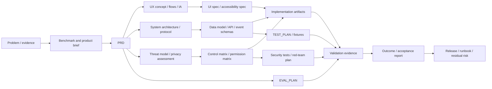
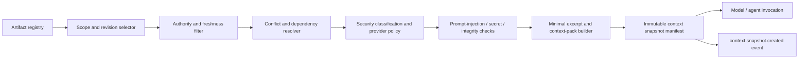

# AIwright Platform — planning, design, and assurance artifact architecture

> **Status:** Draft / normative RFC extension  
> **Version:** 0.1  
> **Date:** 2026-08-21  
> **Scope:** Product-planning, UX/design, architecture, security, evaluation, delivery, and operational artifacts

## 1. Decision

AIwright Platform must treat planning and design outputs as **first-class governed artifacts**, not as arbitrary files attached to a task.

The same document can serve several roles at once:

- human-readable design record;
- instruction source for an agent;
- evaluation target;
- approval or release gate;
- source of later organizational guidance;
- sensitive data container;
- supply-chain input to another prompt, skill, agent, or automation.

For that reason, every artifact that can influence a task, model context, permission decision, implementation, evaluation, or release must carry provenance, authority, revision, dependency, security classification, and lifecycle state.

The common flow is:

```text
problem or evidence
  -> planning/design artifact
  -> review and approval
  -> context eligibility decision
  -> task execution and implementation artifacts
  -> validation evidence
  -> outcome and post-review
  -> superseded knowledge or reusable intervention
```

## 2. Why this is part of the runtime architecture

A PRD, `AGENTS.md`, threat model, task plan, prompt fragment, UI specification, or test plan is not passive documentation once an LLM agent can read and act on it.

A stale, conflicting, poisoned, or over-privileged artifact can cause:

- incorrect task scope;
- prompt or instruction injection;
- privilege escalation through a misleading permission document;
- implementation drift;
- invalid evaluation results;
- propagation of unreviewed AI-generated claims;
- leakage of confidential information when the artifact is loaded into model context;
- repeated failures across every project that consumes a shared template or skill.

The artifact subsystem therefore sits between project knowledge, context assembly, execution, evaluation, and governance.

## 3. Artifact classes

### 3.1 Common supertype

All artifacts use the common `artifact` entity, but behavior differs by class.

```text
artifact
  ├── governance_artifact
  ├── context_artifact
  ├── implementation_artifact
  ├── evidence_artifact
  └── operational_artifact
```

| Class | Purpose | Typical examples |
|---|---|---|
| `governance_artifact` | Defines intent, boundaries, decisions, controls, or approval conditions | PRD, ADR, threat model, permission matrix, policy |
| `context_artifact` | Supplies model-visible or agent-visible task context | prompt fragment, skill, context pack, project map, knowledge note |
| `implementation_artifact` | Represents a produced or changed work product | source file, patch, schema, UI asset, generated document |
| `evidence_artifact` | Supports or refutes a claim or outcome | test report, CI result, review, fixture result, acceptance report |
| `operational_artifact` | Supports deployment, recovery, support, and incident handling | runbook, rollout plan, rollback plan, incident timeline, postmortem |

One artifact may have several tagged purposes, but it has one primary class for lifecycle and access-control behavior.

### 3.2 Planning and design taxonomy

#### Product and discovery

- `PROBLEM_STATEMENT`
- `BENCHMARK`
- `PRODUCT_BRIEF`
- `PRD`
- `SCOPE_DECISION`
- `ASSUMPTION_REGISTER`
- `DEPENDENCY_REGISTER`

#### UX and product design

- `UX_CONCEPT`
- `PERSONA_OR_ACTOR_MODEL`
- `JOURNEY_MAP`
- `USER_FLOW`
- `INFORMATION_ARCHITECTURE`
- `WIREFRAME`
- `UI_SPEC`
- `ACCESSIBILITY_SPEC`
- `DESIGN_SYSTEM_DECISION`
- `CONTENT_SPEC`

#### Architecture and implementation design

- `SYSTEM_ARCHITECTURE`
- `PROTOCOL_SPEC`
- `DATA_MODEL`
- `API_SPEC`
- `EVENT_SCHEMA`
- `INTEGRATION_SPEC`
- `ADR`
- `MIGRATION_PLAN`
- `COMPATIBILITY_MATRIX`
- `CAPACITY_MODEL`

#### Security, privacy, and governance

- `DATA_CLASSIFICATION`
- `THREAT_MODEL`
- `ABUSE_CASE_CATALOG`
- `SECURITY_ARCHITECTURE`
- `SECURITY_CONTROL_MATRIX`
- `PERMISSION_MATRIX`
- `PRIVACY_IMPACT_ASSESSMENT`
- `RETENTION_POLICY`
- `MODEL_PROVIDER_POLICY`
- `MCP_TOOL_TRUST_RECORD`
- `INCIDENT_RESPONSE_PLAN`

#### Evaluation and assurance

- `EVAL_PLAN`
- `TEST_PLAN`
- `FIXTURE_INVENTORY`
- `RED_TEAM_PLAN`
- `EVALUATOR_RUBRIC`
- `CALIBRATION_REPORT`
- `CONFORMANCE_REPORT`
- `SECURITY_REVIEW`
- `ACCEPTANCE_REPORT`
- `RESIDUAL_RISK_RECORD`

#### Delivery and operation

- `TASK_PLAN`
- `RELEASE_PLAN`
- `ROLLOUT_PLAN`
- `ROLLBACK_PLAN`
- `RUNBOOK`
- `CHANGELOG`
- `OPERATIONAL_READINESS_REVIEW`
- `INCIDENT_RECORD`
- `POSTMORTEM`

The taxonomy is extensible through domain packs. A domain pack may add artifact types, but it must not change the universal artifact lifecycle or security fields.

## 4. Artifact manifest

The platform stores metadata separately from content. The manifest is the authoritative control object.

```json
{
  "artifact_id": "art_01J...",
  "artifact_type": "THREAT_MODEL",
  "artifact_class": "governance_artifact",
  "title": "AIwright Platform Threat Model v0.1",
  "scope": {
    "tenant_id": null,
    "workspace_id": null,
    "project_id": "project_aiwright_platform",
    "task_ids": ["task_protocol_v01"]
  },
  "revision": {
    "version": "0.1.0",
    "revision_id": "rev_01J...",
    "source_system": "git",
    "source_uri": "repo://docs/threat-model/v0.1.md",
    "source_revision": "commit-sha",
    "content_hash": "sha256:...",
    "supersedes": null
  },
  "provenance": {
    "created_by_actor": "actor_tom",
    "created_by_type": "human_with_agent_assistance",
    "generated_by_model": null,
    "derived_from": ["art_prd", "art_security_review"],
    "origin_task_id": "task_rfc_security_review",
    "origin_run_id": "run_01J..."
  },
  "governance": {
    "lifecycle_state": "reviewed",
    "authority": "reviewed_reference",
    "owner_actor": "actor_tom",
    "required_review_roles": ["security_reviewer", "architecture_owner"],
    "approval_refs": [],
    "unresolved_finding_refs": ["finding_sec_03"]
  },
  "security": {
    "classification": "confidential",
    "integrity_requirement": "high",
    "content_mode": "full_content_local",
    "context_trust": "reviewed_internal",
    "allowed_provider_classes": ["local", "approved_enterprise"],
    "prompt_injection_scan": "passed_with_warnings",
    "secret_scan": "passed",
    "malware_scan": "not_applicable",
    "signature_status": "verified"
  },
  "context_policy": {
    "eligible": true,
    "instruction_role": "project_security_constraint",
    "precedence": 80,
    "allowed_task_types": ["software_change", "security_review"],
    "max_excerpt_tokens": 3000,
    "expires_at": "2026-11-21T00:00:00Z"
  },
  "relations": {
    "constrains": ["art_protocol", "art_permission_matrix"],
    "validated_by": ["art_security_test_report"],
    "conflicts_with": [],
    "implements": []
  }
}
```

### 4.1 Minimum required fields

Every registered artifact must include:

- artifact identity and type;
- immutable revision identity;
- source URI or content reference;
- content hash where content is available;
- owner and provenance;
- lifecycle state and authority;
- security classification and content mode;
- context eligibility decision;
- dependency or relationship references;
- effective and expiry information where applicable.

A file name alone is never enough to establish authority.

## 5. Authority and lifecycle

### 5.1 Lifecycle states

```text
captured
  -> draft
  -> review_requested
  -> reviewed
  -> approved
  -> canonical
  -> superseded
  -> deprecated
```

Exceptional states:

```text
quarantined | rejected | integrity_failed | expired
```

### 5.2 Authority levels

| Authority | Meaning | Automatic context use |
|---|---|---|
| `untrusted_external` | Imported from an external or uncontrolled source | No |
| `generated_draft` | Produced by an agent or automation and not independently reviewed | No |
| `working_draft` | Human or mixed-authorship work in progress | Only by explicit task selection |
| `reviewed_reference` | Reviewed and usable as supporting context | Yes, within declared scope |
| `approved_control` | Approved requirement, policy, or design constraint | Yes |
| `canonical` | Current authoritative project source | Yes |
| `superseded` | Replaced by a newer revision | No, except historical replay |
| `deprecated` | Retained for compatibility or historical reasons | No by default |

### 5.3 Promotion rules

- AI-generated or externally imported content cannot promote itself.
- A new revision is immutable; edits produce another revision.
- `approved_control` and `canonical` require identified human or policy-authorized approval.
- Unresolved critical security, privacy, protocol, or data-integrity findings block promotion.
- Expired, integrity-failed, or superseded artifacts are excluded from automatic context assembly.
- Security policies, permission matrices, provider policies, and incident-response plans require separation of author and approver in managed mode.
- A generated summary cannot silently replace its source artifact.
- Promotion decisions and denials are audit events.

## 6. Artifact dependency graph



The graph supports:

- traceability from requirement to implementation and evidence;
- detection of stale dependencies;
- context selection;
- change-impact analysis;
- release/readiness gates;
- security-policy enforcement;
- post-session review.

## 7. Required artifact gates

### Gate G0 — product boundary

Required:

- problem statement;
- benchmark;
- PRD;
- scope and non-goal decision;
- repository-boundary ADR.

### Gate G1 — protocol and security design

Required:

- protocol glossary and schema;
- artifact and evidence model;
- context-provenance model;
- threat model;
- security architecture;
- data classification;
- permission model;
- pilot EVAL_PLAN;
- fixture inventory.

### Gate G2 — implementation readiness

Required for each slice:

- bounded technical spec;
- task plan;
- test plan;
- security-control applicability record;
- migration/compatibility decision where applicable;
- explicit non-goals;
- acceptance evidence plan.

### Gate G3 — pilot acceptance

Required:

- conformance report;
- security and privacy test report;
- evaluator calibration report;
- usability/feedback report;
- residual-risk record;
- operational readiness review.

### Gate G4 — hosted service readiness

Required:

- tenant-isolation design and test report;
- RBAC/ABAC and permission matrix;
- privacy impact assessment;
- retention/deletion verification;
- incident-response plan and drill result;
- backup/restore and recovery evidence;
- monitoring and alert-routing design;
- release and rollback plan.

### Gate G5 — production change

Required:

- approved change record;
- affected-artifact graph;
- validation evidence;
- security-policy diff;
- deployment and rollback plan;
- operational owner;
- post-release observation window.

A gate is a policy evaluation over artifact manifests and evidence, not a folder-presence check.

## 8. Context assembly from artifacts

Only context-eligible revisions may enter model context automatically.



### 8.1 Assembly rules

- Select the smallest sufficient artifact excerpts.
- Prefer canonical current revisions over summaries or duplicated copies.
- Preserve source, revision, authority, classification, and excerpt boundaries.
- Do not collapse system, project, task, user, external, and tool-derived instructions into one indistinguishable text block.
- Mark external and generated content as untrusted data unless explicitly promoted.
- Detect conflicting approved artifacts before execution.
- If a required artifact is stale or missing, report the gap rather than silently substitute a guessed source.
- Record every artifact revision loaded into each context snapshot.
- Context compaction must retain security constraints and provenance references or explicitly record that they were lost.

### 8.2 Artifact taint

An artifact is tainted when its content or derivation includes untrusted external material, unresolved prompt-injection indicators, unverifiable source integrity, or a quarantined dependency.

Taint propagates through generated summaries and derived context packs until a review or deterministic transformation explicitly clears the applicable condition. Tainted artifacts may still be analyzed, but they cannot grant authority or unlock privileged actions.

## 9. Drift and conflict detection

The platform should detect at least:

- implementation changed without updating an affected spec or test plan;
- canonical artifact points to a stale repository revision;
- two approved artifacts define conflicting requirements;
- permission matrix and actual tool scopes diverge;
- threat model changed but security tests were not refreshed;
- EVAL_PLAN or rubric changed without evaluator-version change;
- a generated summary omits a critical constraint from its source;
- a context pack used a superseded or expired artifact;
- an external tool or MCP server changed its schema or description after approval;
- a release was performed without the required readiness artifacts.

Drift findings must reference exact artifact revisions and affected tasks.

## 10. Storage and integrity

### 10.1 Metadata and content separation

- Registry metadata belongs in the local SQLite or hosted PostgreSQL control store.
- Git remains the preferred source for reviewable text architecture and policy documents.
- Large or sensitive blobs use project-controlled local storage or encrypted object storage.
- External artifacts may remain external and be referenced by immutable revision, URL, and hash.
- The platform should avoid copying complete repositories, attachments, or reports when a revision reference and evidence summary are sufficient.

### 10.2 Integrity controls

- content hashes;
- immutable revision IDs;
- optional signatures for approved controls and distributed templates;
- repository commit references;
- source-system and retrieval-time metadata;
- integrity revalidation before privileged context use;
- quarantine on hash/signature mismatch;
- audit of promotion, access, context loading, and export.

## 11. Access-control model

Suggested artifact operations:

```text
artifact.metadata.read
artifact.content.read
artifact.content.export
artifact.create
artifact.revise
artifact.review
artifact.approve
artifact.promote
artifact.deprecate
artifact.context.load
artifact.security.override
```

Raw content access is separate from metadata access. Approval does not imply permission to read every source artifact. Context loading is a distinct privileged operation because it can export content to a model provider.

Managed mode should support:

- project- and classification-scoped roles;
- attribute checks for provider, purpose, task, and content mode;
- temporary review access;
- audited break-glass access;
- separation of author, security reviewer, and approver for high-impact controls.

## 12. Artifact events

Initial events:

```text
artifact.registered
artifact.revision.created
artifact.review.requested
artifact.review.completed
artifact.approval.granted
artifact.approval.denied
artifact.promoted
artifact.superseded
artifact.deprecated
artifact.quarantined
artifact.integrity.failed
artifact.conflict.detected
artifact.drift.detected
artifact.context.loaded
artifact.context.denied
artifact.content.accessed
artifact.exported
```

Every event references artifact and revision IDs. Security-sensitive events also carry policy-decision and actor references.

## 13. Product surfaces

### 13.1 Local CLI

Initial commands may include:

```text
aiwright-platform artifact register
aiwright-platform artifact status
aiwright-platform artifact graph
aiwright-platform artifact review
aiwright-platform artifact context-preview
aiwright-platform artifact verify
```

The pilot does not require a full document editor.

### 13.2 Hosted UI

Add an `Artifacts` view with:

- current authority and revision;
- lineage and dependency graph;
- unresolved findings;
- security classification and context eligibility;
- tasks, runs, and context snapshots that consumed the artifact;
- superseded or conflicting revisions;
- approvals and access audit;
- release/readiness gate status.

## 14. MVP boundary

P0 implements only what is necessary to prove traceability:

- artifact manifest schema;
- Git/file/external-reference registration;
- immutable revisions and hashes;
- lifecycle and authority states;
- basic dependency graph;
- context-eligibility checks;
- security classification and content mode;
- context snapshot references;
- drift findings for missing validation and superseded context;
- CLI and Markdown reports.

P0 does not implement a collaborative document editor, general knowledge-management UI, or automatic promotion of generated documents.

## 15. Required initial artifacts for the next phase

Before implementation-repository bootstrap, the following must be created and registered under this architecture:

1. Protocol glossary v0.1.
2. Event envelope and artifact-manifest schemas.
3. Context provenance and instruction-layer specification.
4. Evidence model v0.1.
5. Security architecture and control matrix.
6. Threat model and abuse-case catalog.
7. Data-classification and provider/export policy.
8. Permission and action-risk matrix.
9. Pilot EVAL_PLAN.
10. Codex fixture inventory and mapping specification.
11. Test plan and security red-team plan.
12. Repository-boundary and storage ADRs.

## 16. Acceptance criteria

This architecture is acceptable when:

- every model-visible planning or design input can be traced to an artifact revision;
- generated or external artifacts cannot silently become authoritative;
- approved controls can be distinguished from working drafts;
- security classification affects provider export and context eligibility;
- stale, conflicting, superseded, or integrity-failed artifacts are detectable;
- release/readiness gates evaluate relationships and evidence, not file existence;
- artifact bodies are not duplicated when immutable references are sufficient;
- artifact access, context loading, and export are independently auditable.
