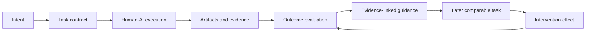

# AIwright Platform — PRD v0.1

> **Status:** Draft RFC  
> **Date:** 2026-08-21  
> **Owner:** TOM / AIwright  
> **Product class:** AI work intelligence, evaluation, guidance, and governance  
> **Initial surface:** Codex CLI/SDK development workflows  
> **Long-term surface:** provider-, client-, task-, and automation-agnostic

## 1. Executive summary

AIwright Platform observes how a person and one or more AI agents attempt a task, reconstructs the work as a task graph, evaluates the result against explicit outcome evidence, and returns low-noise guidance that can be measured on later work.

The product is designed around this distinction:

```text
LLM observability asks:  What model call happened?
AI work intelligence asks: Did the user reach a validated outcome, why or why not,
                           and what intervention is likely to improve the next attempt?
```

The existing `aiwright` project already covers prompt composition, linting, scoring, user-pattern profiling, and tool adapters. The proposed platform adds the missing runtime loop:

```text
capture -> normalize -> reconstruct -> evaluate -> guide -> verify improvement
```

The platform must not become a hidden employee-monitoring product. Individual coaching is private by default. Team views prioritize aggregated workflow failures, policy risks, and reusable practices rather than personal rankings.

## 2. Problem statement

### 2.1 Users cannot explain why an AI-assisted task succeeded or failed

A transcript alone does not show whether the task was well scoped, whether required context was omitted, whether the agent entered a tool retry loop, whether an output was validated, or whether later corrections invalidated an earlier completion claim.

### 2.2 Prompt-quality scoring is not equivalent to work quality

A structurally complete prompt can still produce the wrong artifact. A terse prompt can be sufficient when the project already supplies strong context. Optimizing only prompt length, specificity, or token count will produce misleading recommendations unless the system also observes task type, available context, execution evidence, and final outcome.

### 2.3 Existing telemetry is fragmented around model calls

LLM observability systems are effective at recording requests, responses, tokens, latency, tools, traces, prompts, and evaluations. They generally do not own the user-level contract that may span several sessions, models, tools, reviews, and artifacts.

### 2.4 Feedback is usually generic and not causally testable

Advice such as “be more specific” or “add more context” is only useful when it points to evidence, explains the likely impact, and can be compared against a later similar task. Without that structure, recommendations become another stream of AI-generated noise.

### 2.5 Organization-wide adoption creates governance risk

Prompts and tool outputs can contain source code, credentials, customer data, internal policy, personal information, and commercially sensitive material. A team dashboard can also become a performance-ranking system even when the original intent was coaching. Collection, access, retention, and aggregation therefore belong in the product contract, not in a later compliance phase.

## 3. Product vision

> Give every AI user and AX platform owner an evidence-backed view of how work moved from intent to outcome, then recommend the smallest intervention that measurably improves the next comparable task.

### 3.1 Product thesis

The defensible unit is not a prompt. It is a **validated task outcome with its execution evidence**.

### 3.2 Long-term product loop



## 4. Product principles

1. **Outcomes over activity.** Prompt count, token volume, and session count are operational signals, not success metrics.
2. **Evidence over judgment.** Every finding must identify the event, message, tool call, artifact, validation result, or user feedback that supports it.
3. **Observe first, interpret later.** Raw observations and derived interpretations remain separate and independently reprocessable.
4. **Task scope over transcript scope.** One task may span multiple sessions, agents, models, and tools.
5. **Local-first privacy.** Sensitive content is redacted before export; full-content capture requires an explicit mode.
6. **User agency over silent intervention.** Guidance can be accepted, dismissed, edited, or disabled. Style advice does not block work.
7. **No opaque universal score.** Show dimensions, evidence, evaluator version, and confidence instead of an unexplained “AIQ.”
8. **Provider independence.** Codex is the first adapter, not the canonical data model.
9. **Collector failure must not break the host workflow.** Telemetry is best-effort and isolated from task execution.
10. **Version everything that changes interpretation.** Event schemas, redaction rules, evaluators, rubrics, prompts, policies, and recommendations are versioned.

## 5. Target users and jobs to be done

### 5.1 Individual AI user

**Jobs**

- Understand where a task lost time, context, or correctness.
- Receive a small number of actionable improvements tied to evidence.
- Compare later work without exposing private content to a team administrator.
- Reuse proven task briefs, validation patterns, or prompt fragments.

### 5.2 AX / AI platform administrator

**Jobs**

- Instrument managed AI interfaces once and normalize activity across providers.
- Detect systemic workflow failures, policy violations, cost anomalies, and missing validation.
- Identify which playbooks or system-level changes improve outcomes.
- Manage collection, redaction, access, retention, and export policies.

### 5.3 Application or automation developer

**Jobs**

- Add a standard adapter rather than build a bespoke analytics pipeline.
- Correlate model, tool, agent, and artifact events with the owning task.
- Create regression datasets from failed production or internal workflows.
- Export compatible telemetry to existing observability systems.

### 5.4 Evaluator, security, or governance owner

**Jobs**

- Define versioned rubrics and deterministic checks.
- Audit how a finding was produced.
- Separate policy findings from productivity suggestions.
- Review redacted evidence without unnecessary prompt access.

## 6. Goals

### G1. Reconstruct AI-assisted work as a task graph

Correlate task, run, session, turn, model invocation, tool invocation, artifact change, validation, feedback, and outcome events.

### G2. Evaluate work with multiple evidence classes

Combine deterministic rules, runtime/process signals, artifact validation, user feedback, and optional LLM evaluators. No single evaluator is authoritative for every task.

### G3. Produce evidence-linked guidance

Each recommendation explains the finding, evidence, likely consequence, confidence, suggested action, and how improvement can be measured.

### G4. Support portable instrumentation

Provide a versioned internal event envelope with Codex and OpenTelemetry adapters, then add other clients without changing the domain model.

### G5. Make privacy and organizational visibility enforceable

Provide explicit content modes, redaction before export, tenant isolation, retention controls, audit logs, and non-ranking team aggregation.

### G6. Turn failures into reusable knowledge

Promote confirmed failure cases into evaluation datasets, task templates, prompt fragments, skills, or policy checks through an explicit review path.

## 7. Non-goals

The initial product will not:

- replace Codex, ChatGPT, Claude Code, Cursor, or another chat/agent runtime;
- proxy every model request as a mandatory gateway;
- infer employee performance or rank individuals;
- store or reconstruct hidden chain-of-thought;
- claim causality from one session or one LLM-as-judge score;
- train or fine-tune foundation models;
- replace Langfuse, Phoenix, Opik, an APM system, or a security DLP product;
- instrument arbitrary consumer chat websites through brittle browser scraping;
- provide fully autonomous prompt rewriting before the observation model is validated;
- optimize for minimum tokens regardless of quality, risk, or task completion.

## 8. Domain model

### 8.1 Core entities

| Entity | Definition |
|---|---|
| `tenant` | Security and billing boundary. Optional in local mode. |
| `workspace` | Team or organizational grouping inside a tenant. |
| `project` | Product, repository, operational area, or personal work context. |
| `actor` | Human, agent, service, evaluator, or policy engine. Human identity may be pseudonymized. |
| `task` | User-level goal with expected outcome and validation criteria. Can span several sessions. |
| `run` | One attempt to execute a task under a specific configuration and context snapshot. |
| `session` | Client or agent conversation/thread boundary. |
| `turn` | One user/agent interaction cycle. |
| `span` | Timed operation such as model inference, tool call, retrieval, or workflow step. |
| `message` | Model-visible or user-visible content reference. Content is stored separately from metadata. |
| `artifact` | File, patch, document, record, deployment, issue, PR, report, or other produced object. |
| `evidence` | Test, check, approval, user confirmation, workflow state, diff, or external result used to verify an outcome. |
| `evaluation` | Versioned assessment with method, dimensions, score/label, explanation, confidence, and evidence references. |
| `finding` | Diagnosed issue or strength derived from observations and evaluations. |
| `intervention` | Suggested or applied change to task framing, context, prompt, policy, workflow, tool, or validation. |
| `feedback` | User or reviewer reaction to output, finding, or intervention. |
| `outcome` | `validated`, `completed_unverified`, `partial`, `failed`, `abandoned`, or `blocked`, with supporting evidence. |

### 8.2 Task contract

A task contract gives evaluation a stable target. It may be supplied directly, generated from intake, or inferred and then confirmed.

```json
{
  "task_id": "task_...",
  "intent": "Refactor the authentication middleware without changing public behavior",
  "task_type": "software_change",
  "expected_artifacts": ["code_diff", "test_result", "review_summary"],
  "acceptance_checks": [
    "existing authentication tests pass",
    "new regression test covers expired sessions",
    "no public API contract changes"
  ],
  "risk_level": "medium",
  "privacy_mode": "full_content_local",
  "budget": {
    "max_turns": 20,
    "max_cost_usd": null
  }
}
```

A task without an explicit contract can still be captured, but evaluation confidence is reduced and the report must say why.

### 8.3 Event envelope

The internal envelope is versioned independently from any provider or OpenTelemetry revision.

```json
{
  "envelope_version": "0.1",
  "event_id": "evt_...",
  "occurred_at": "2026-08-21T05:00:00Z",
  "event_type": "tool.invocation.completed",
  "source": {
    "adapter": "codex-sdk",
    "adapter_version": "0.1.0",
    "client": "codex",
    "provider": "openai",
    "model": "provider-reported-model"
  },
  "scope": {
    "tenant_id": null,
    "workspace_id": null,
    "project_id": "project_...",
    "task_id": "task_...",
    "run_id": "run_...",
    "session_id": "session_...",
    "turn_id": "turn_...",
    "span_id": "span_...",
    "parent_span_id": "span_parent_..."
  },
  "privacy": {
    "mode": "redacted_content",
    "classification": ["source_code"],
    "redaction_policy_version": "redact-v1"
  },
  "payload": {
    "metadata": {},
    "content_ref": "blob_...",
    "content_hash": "sha256:..."
  }
}
```

Initial event families:

```text
session.started | session.ended
run.started | run.completed | run.failed
task.declared | task.updated | task.completed | task.abandoned
turn.started | turn.completed | turn.failed
message.submitted | message.generated
model.invocation.started | model.invocation.completed | model.invocation.failed
tool.invocation.started | tool.invocation.completed | tool.invocation.failed
artifact.created | artifact.updated | artifact.deleted
validation.started | validation.completed | validation.failed
context.compacted
feedback.recorded
evaluation.result
finding.created | finding.dismissed | finding.accepted
intervention.suggested | intervention.applied | intervention.dismissed
policy.blocked
```

## 9. Core user journeys

### Journey A. Local post-session review

1. User starts or imports a Codex task.
2. Collector records structured events without blocking Codex.
3. Local privacy policy redacts secrets and classifies content.
4. Reducer reconstructs the task/session graph.
5. Evaluator finds evidence-backed friction and strengths.
6. User receives a post-session report with no more than the configured finding limit.
7. User accepts, dismisses, or edits recommendations.
8. Accepted recommendations can become a reusable task template, prompt fragment, skill, or validation rule.

### Journey B. Comparable-task improvement

1. A later task is classified as comparable by task type and context, not merely by prompt similarity.
2. User chooses whether to apply a prior intervention.
3. Platform records the intervention version and exposure.
4. Outcome metrics are compared against a baseline with uncertainty stated.
5. Recommendation confidence is increased, reduced, or retired.

### Journey C. Team-level AX diagnosis

1. Organization enables managed collection with a documented policy.
2. Individual content remains private unless explicitly shared.
3. Dashboard aggregates workflow patterns above a minimum cohort threshold.
4. Admin sees systemic findings such as missing acceptance checks, repeated tool failures, high unverified completion, or costly context churn.
5. Admin changes a shared template, skill, model route, tool, or policy.
6. Platform measures the change at workflow/cohort level.

## 10. Functional requirements

### P0 — pilot requirements

#### FR-01 Task declaration and outcome capture

- Create, update, resume, complete, abandon, or block a task.
- Associate several sessions and runs with one task.
- Record expected artifacts and acceptance checks.
- Record outcome basis and verification evidence.

#### FR-02 Codex structured-event ingestion

- Support Codex SDK/thread events.
- Support `codex exec` JSONL events.
- Import local rollout-trace bundles only through an explicit diagnostic flow.
- Preserve provider event IDs and raw references for audit.
- Reject malformed events without terminating the host process.

#### FR-03 Privacy edge

- Apply secret detection, configured redaction, field allowlists, and payload-size limits before managed export.
- Separate metadata from content blobs.
- Record content mode and redaction-policy version on every event.
- Allow collection to be disabled per project or task.

#### FR-04 Append-only raw event storage

- Preserve event ordering and source identity.
- Make ingestion idempotent.
- Support deterministic replay into later reducer/evaluator versions.
- Treat raw data as evidence, not as an interpretation.

#### FR-05 Task-graph normalization

- Correlate tasks, sessions, turns, model calls, tool calls, artifacts, and validations.
- Keep model-visible messages distinct from runtime-only output.
- Identify missing or ambiguous relationships rather than invent them.

#### FR-06 Timeline and replay

- Show chronological and graph views.
- Distinguish user actions, model output, tool/runtime work, artifact changes, evaluations, and interventions.
- Link each derived finding to its supporting events.

#### FR-07 Deterministic diagnostics

The initial rule set must include at least:

- missing or materially ambiguous task goal;
- no declared acceptance or validation method;
- repeated instruction or duplicated context;
- requirement change without task/plan update;
- repeated failed tool call or command loop;
- error ignored without triage;
- artifact change without relevant validation;
- completion claim without evidence;
- excessive context churn or compaction risk when observable;
- secrets or disallowed data detected before export.

#### FR-08 Post-session report

A report contains:

- task and outcome summary;
- evidence completeness;
- cost, token, latency, retry, and validation signals when available;
- strongest confirmed practice;
- highest-impact friction findings;
- residual risks and unknowns;
- one or more suggested interventions, each linked to evidence;
- evaluator, rule, schema, and redaction versions.

#### FR-09 Feedback loop

- Mark a finding or recommendation as useful, not useful, incorrect, already known, or unsafe.
- Store feedback separately from the evaluated session.
- Use feedback to calibrate evaluator versions, not silently rewrite history.

#### FR-10 Portable export

- Export normalized events and reports as JSONL.
- Preserve an OpenTelemetry mapping without making OpenTelemetry development attributes the database schema.
- Allow raw content to be omitted independently from metadata.

### P1 — after pilot validation

#### FR-11 Versioned evaluation datasets

Create reviewed cases from sessions, failures, artifacts, expected outcomes, and feedback. Dataset promotion requires a human-visible approval step.

#### FR-12 LLM evaluators

- Evaluate only defined dimensions with a versioned rubric.
- Store model, prompt/rubric version, score/label, explanation, confidence, and evidence references.
- Support deterministic fallback.
- Calibrate against human-labeled cases.
- Never use one judge score as the sole task outcome.

#### FR-13 Intervention library

Manage task templates, prompt fragments, skills, context packs, validation checks, and policy suggestions with versions and applicability rules.

#### FR-14 Experiment comparison

Compare baseline and intervention variants by task class. Report sample size, data exclusions, and uncertainty. Do not imply causality when assignment is observational.

### P2 — hosted/team platform

#### FR-15 Workspace dashboard

Show task-outcome trends, workflow friction, validation gaps, costs, reliability, and policy findings. Individual rankings are prohibited by default.

#### FR-16 RBAC and audit

Provide tenant/workspace/project roles, access logs, policy-change history, and content-access auditing.

#### FR-17 Adapter SDK

Publish contracts and conformance tests for new clients, providers, gateways, and agent runtimes.

## 11. Evaluation model

### 11.1 Evidence hierarchy

1. **Deterministic structural evidence** — required fields, contradictions, duplicate segments, policy matches.
2. **Runtime/process evidence** — retries, failures, latency, tool sequences, context changes, abandoned runs.
3. **Artifact evidence** — diffs, tests, checks, schemas, external workflow states, approvals.
4. **Outcome evidence** — acceptance checks, user confirmation, production result, rollback, defect report.
5. **Human feedback** — usefulness, correctness, business fit, safety concerns.
6. **LLM evaluation** — semantic quality or rubric interpretation when deterministic checks are insufficient.

Higher numbers do not automatically override lower numbers. The evaluator states which evidence class supports each claim.

### 11.2 Finding contract

```json
{
  "finding_id": "finding_...",
  "type": "completion_without_validation",
  "severity": "high",
  "confidence": 0.96,
  "evidence_refs": ["evt_101", "artifact_8"],
  "explanation": "The run changed authentication code and reported completion, but no relevant test or review evidence was recorded.",
  "likely_consequence": "Regression risk remains unbounded.",
  "recommended_action": "Run the authentication regression suite and attach the result to the task outcome.",
  "counterfactual_measure": "A later comparable task should reach validated outcome without a post-completion correction.",
  "evaluator": {
    "type": "deterministic_rule",
    "name": "validation-evidence-rule",
    "version": "0.1.0"
  }
}
```

### 11.3 Feedback timing

| Timing | Default behavior |
|---|---|
| Preflight | Optional and minimal. Ask only for missing information that materially changes evaluation or safety. |
| In-session | Notify only for security/policy blocks or strong loop/failure signals. Avoid constant prompt coaching. |
| Post-turn | Available on demand; not the default primary interface. |
| Post-session | Primary MVP feedback surface. Evidence-linked and finding-limited. |
| Periodic | Aggregate personal or team patterns after sufficient comparable samples. |

## 12. Success metrics

### 12.1 North-star metrics

- **Validated task outcome rate** by comparable task class.
- **Median time to validated outcome.**
- **Cost per validated outcome** when provider usage is available.

### 12.2 Diagnostic metrics

- turns and runs per validated outcome;
- repeated-instruction and duplicated-context rate;
- tool failure, retry, and unresolved-error rate;
- completion-without-validation rate;
- user correction and reopening rate;
- task abandonment rate;
- intervention acceptance, dismissal, and later effect;
- finding precision based on user/reviewer feedback;
- session/task reconstruction coverage.

### 12.3 Guardrail metrics

- collector-caused host failures;
- capture-policy violations;
- unredacted-secret export incidents;
- cross-tenant access violations;
- evaluator disagreement and drift;
- false or unsupported findings;
- feedback alert volume and dismissal rate;
- incremental latency and storage overhead.

### 12.4 Metrics explicitly rejected as primary KPIs

- total prompts;
- total tokens saved without outcome context;
- session count;
- prompts per employee;
- one-number personal “AIQ”;
- leaderboard position;
- LLM-as-judge score without evidence or calibration.

## 13. Privacy, security, and governance

### 13.1 Content modes

| Mode | Behavior |
|---|---|
| `disabled` | No session collection. |
| `metadata_only` | IDs, timing, type, counts, status, and hashes only. No prompt/output body. |
| `redacted_content` | Content is processed locally and exported after configured redaction. |
| `full_content_local` | Full content stays on the local device or private project-controlled storage. |
| `full_content_managed` | Full content is sent to managed storage only with explicit tenant/project policy. |

Managed/team collection defaults to `metadata_only` or `redacted_content`. `full_content_managed` is never inferred silently.

### 13.2 Required controls

- encryption in transit and at rest;
- tenant isolation and project scoping;
- least-privilege roles;
- content-access audit trail;
- configurable retention and deletion;
- user/project export and deletion;
- secret and personal-data redaction before export;
- payload allowlists and size caps;
- immutable policy/evaluator version references;
- signed or checksummed raw-event batches when tamper evidence is required;
- no storage of hidden chain-of-thought;
- explicit treatment of third-party LLM evaluation as a data export.

### 13.3 Anti-surveillance product policy

- Personal coaching is visible to the user by default.
- Team dashboards aggregate workflows and cohorts, not named individual rankings.
- Raw prompt access requires a separately audited permission.
- Small cohorts are suppressed using a configurable minimum threshold.
- A manager cannot use a hidden composite score as an employment decision signal through a default feature.
- Every managed deployment exposes what is collected, why, who can access it, and how long it is retained.

## 14. Non-functional requirements

### Reliability

- Collection and export are asynchronous or buffered.
- Collector failure cannot fail the user task.
- Ingestion is idempotent and replayable.
- Reducers and evaluators are deterministic for the same inputs and version.

### Performance

- The pilot measures overhead rather than assuming it is negligible.
- Content processing uses payload limits and streaming where necessary.
- High-cardinality content is stored outside indexed metadata.

### Compatibility

- Internal envelope versions support additive evolution and explicit migration.
- Provider-specific fields remain namespaced.
- OpenTelemetry import/export is adapter-owned.
- Unknown events are preserved when safe instead of discarded.

### Operability

- Every report records source coverage and missing data.
- Health and ingestion errors are observable without exposing content.
- Reprocessing can target a new reducer/evaluator version without rewriting raw history.

### Accessibility and UX

- Reports prioritize plain evidence and actions over scores.
- Users can filter or disable recommendation classes.
- The interface distinguishes observed fact, inference, evaluation, and user-confirmed outcome.

## 15. MVP scope: local Codex outcome-intelligence pilot

### Included

- task contract and outcome commands/API;
- Codex SDK and `codex exec` JSONL adapters;
- opt-in rollout-trace importer for deep local diagnosis;
- append-only local event store;
- deterministic task-graph reducer;
- metadata/content separation and local redaction;
- initial deterministic diagnostic rules;
- terminal and Markdown post-session report;
- user feedback on findings;
- JSONL/OpenTelemetry-compatible export;
- fixture-based conformance and regression tests.

### Excluded

- multi-tenant SaaS;
- organization dashboard;
- mandatory gateway/proxy;
- live prompt rewriting;
- automatic employee scoring;
- broad browser-extension capture;
- generalized support for every chat client;
- ClickHouse, Kafka, or distributed stream infrastructure;
- autonomous policy changes;
- production LLM judge as a hard gate.

## 16. Pilot acceptance gates

Targets below are **validation hypotheses**, not guaranteed product outcomes.

### Data and reliability

- Reconstruct at least 90% of supported Codex pilot sessions into valid task/session/turn/tool/artifact relationships.
- Every derived finding has at least one valid evidence reference.
- Importing malformed or partial events produces a bounded diagnostic rather than a false complete graph.
- No pilot task fails because the collector, reducer, or exporter failed.

### Feedback quality

- Human reviewers label at least 70% of surfaced high-severity findings as correct and actionable.
- The report surfaces no more than the configured finding limit and explains suppressed lower-priority findings.
- Unsupported advice is measurable through feedback and blocks evaluator promotion.

### Outcome value

- Establish a baseline by task class before claiming improvement.
- On repeated comparable tasks, test whether accepted interventions reduce unverified completion, unnecessary turns, or time to validated outcome.
- Report sample size and uncertainty; do not publish a universal productivity claim from the pilot.

### Privacy

- Every stored event records content mode and policy version.
- No known secret fixture crosses the managed-export boundary unredacted.
- Full-content capture cannot be enabled by an implicit default.

## 17. Principal risks and controls

| Risk | Why it matters | Required control |
|---|---|---|
| Product becomes prompt lint with charts | Low differentiation and weak outcome value | Task contract, artifact evidence, and outcome metrics are P0. |
| Product becomes employee surveillance | Adoption, legal, ethical, and data-quality failure | Private personal view, cohort aggregation, no default leaderboard, audited content access. |
| LLM judge creates authoritative nonsense | Semantic evaluators are variable and biased | Multi-signal hierarchy, calibration dataset, versioning, human feedback, no sole-authority score. |
| “Efficiency” rewards shallow work | Lower tokens can increase defects | Optimize validated outcomes, quality, cost, time, and risk jointly. |
| Schema follows one provider | High migration cost and lock-in | Versioned internal envelope plus adapters. |
| Raw trace leaks sensitive data | Prompts/tools contain high-risk content | Local-first modes, redaction edge, content separation, retention and access controls. |
| Feedback interrupts every turn | Alert fatigue and user rejection | Post-session default; in-session only for strong policy/loop signals. |
| All-user scope prevents MVP validation | No stable task taxonomy or outcome | Start with Codex development tasks and expand through conformance gates. |
| Correlation mistaken for causation | Misleading optimization claims | Baselines, comparable task classes, explicit experiment metadata and uncertainty. |

## 18. Open product decisions

1. Whether the hosted platform repository is `aiwright-platform` or another name under the AIwright family.
2. Whether `@jsnetworkcorp/aiwright` exposes shared intelligence primitives or remains an independent CLI consumed through a bridge.
3. Initial local store: SQLite plus content blobs is recommended for the pilot, but must be confirmed through fixture volume tests.
4. Minimum team cohort threshold and jurisdiction-specific policy packs.
5. Task comparability taxonomy for the first three software-development task classes.
6. Which artifact validators are P0: tests, lint, typecheck, Git diff, PR checks, or user confirmation.
7. Whether OpenTelemetry is import/export only in the pilot or also the internal transport.
8. Promotion process from a confirmed finding to a shared skill, prompt fragment, task template, or policy.

## 19. Product-boundary decision

The recommended decision is:

- Keep `aiwright` as the local prompt/profile intelligence core and CLI.
- Create `aiwright-platform` as a separate, initially private monorepo after this RFC passes review.
- Use Codex as the first structured-event adapter.
- Use `codex-workflow-skills` to generate and consume task contracts, evaluation plans, adversarial review findings, and session closeouts.
- Use `harness-kit` as an intervention-delivery integration for approved agent configuration changes.
- Use `stackforge-atlas` as the engineering contract and evidence reference, not as the runtime data store.
- Use TOM Dev Forge as an early real-world consumer for autonomous development workflows, not as the platform host repository.

This split preserves the existing public package contract while allowing the runtime platform to evolve under stricter privacy, schema, and multi-tenant constraints.
