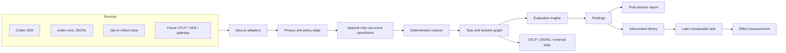

# AIwright Platform — gated delivery roadmap

> **Status:** Draft  
> **Date:** 2026-08-21  
> **Planning rule:** Advance by evidence gates, not by calendar estimates.

## 1. Delivery strategy

The long-term vision is broad, but the first implementation must be narrow enough to falsify the product thesis.

### Vision scope

```text
all managed AI interfaces
all providers and agent runtimes
personal, project, and organization use
chat, automation, and autonomous work
```

### First validation scope

```text
one user/workgroup
Codex CLI/SDK
software-development tasks
local-first collection
post-session guidance
explicit task outcome evidence
```

The platform should expand only when the current adapter, task taxonomy, privacy mode, and evaluation method pass their conformance and usefulness gates.

## 2. Architecture direction

### 2.1 Logical pipeline



### 2.2 Separation of concerns

| Layer | Owns | Must not own |
|---|---|---|
| Adapter | Provider/client event translation and source identity | Product scoring or UI-specific labels |
| Privacy edge | Classification, redaction, allowlists, content mode, export policy | Task evaluation |
| Raw store | Ordered immutable observations and payload references | Derived truth |
| Reducer | Deterministic relationships and projections | LLM-generated advice |
| Evaluation | Versioned rules, rubrics, evidence references and confidence | Silent mutation of source data |
| Guidance | Actionable interventions and applicability | Unexplained blocking decisions |
| Control plane | Policies, roles, projects, datasets, evaluator versions | Provider-specific parsing |
| UI/report | Human-readable evidence and decisions | Canonical computation hidden in components |

### 2.3 Storage strategy

#### Local pilot

- append-only JSONL spool for source events;
- SQLite for normalized task/session projections, evaluation metadata, feedback, and indexes;
- content blobs in a project-controlled directory with hashes and restrictive permissions;
- deterministic rebuild command from raw events;
- no distributed queue, Kafka, ClickHouse, or external object store.

#### Hosted platform after validation

- PostgreSQL for tenants, workspaces, policies, tasks, graph metadata, evaluations, findings, feedback, and audit logs;
- object storage for encrypted optional content blobs and large raw payloads;
- transactional outbox or bounded worker queue before adopting separate stream infrastructure;
- OTLP export to an existing observability backend for operational traces and metrics;
- analytics-store introduction only after measured volume/query pressure justifies it.

### 2.4 Proposed repository topology

The recommended hosted repository is a separate, initially private monorepo:

```text
aiwright-platform/
├── apps/
│   ├── cli/                 # local task, import, reduce, report and export commands
│   ├── api/                 # introduced after local pilot
│   ├── dashboard/           # introduced after outcome/eval validation
│   └── worker/              # reducer/evaluator/export jobs when service mode exists
├── packages/
│   ├── protocol/            # versioned envelope, domain entities and JSON schemas
│   ├── adapter-codex/       # SDK, exec JSONL and trace-bundle import
│   ├── adapter-otel/        # future GenAI/OpenInference mapping
│   ├── privacy/             # classifiers, redaction, capture policies
│   ├── event-store/         # raw spool/store interfaces
│   ├── reducer/             # deterministic task/session graph projection
│   ├── evaluation/          # rule/evaluator contracts and execution
│   ├── guidance/            # finding ranking and intervention contracts
│   ├── sdk/                 # application/automation instrumentation
│   └── aiwright-bridge/     # existing AIwright fragments, profiles and scoring integration
├── fixtures/
│   ├── codex-sdk/
│   ├── codex-exec-jsonl/
│   ├── rollout-trace/
│   ├── privacy/
│   └── malformed/
├── docs/
│   ├── adr/
│   ├── protocols/
│   ├── threat-model/
│   ├── evals/
│   └── pilots/
└── tests/
    ├── conformance/
    ├── integration/
    └── acceptance/
```

Do not copy `aiwright` source into the platform. Define a bridge contract and consume released/local package interfaces. This keeps prompt intelligence independently testable and prevents the hosted product from destabilizing the CLI package.

## 3. Phase 0 — product-boundary review

### Objective

Decide whether the product is sufficiently distinct from generic observability and whether its privacy model is acceptable before implementation.

### Deliverables

- PRD v0.1;
- adjacent-system benchmark;
- this gated roadmap;
- explicit decision on separate repository;
- glossary and domain-boundary review;
- initial privacy/content-mode decision;
- MVP task-class decision.

### Review lenses

- product differentiation;
- developer experience and adapter feasibility;
- data/privacy and employee-surveillance risk;
- evaluation validity;
- operational complexity;
- reuse versus duplication across existing TOM repositories.

### Exit criteria

- Task, run, session, turn, artifact, evidence, outcome, evaluation, finding, intervention, and feedback are not materially ambiguous.
- “All LLM users” remains a vision, not the MVP acceptance surface.
- Team dashboards cannot silently expose individual content or rankings.
- Existing `aiwright` and proposed platform responsibilities are separated.
- At least one falsifiable pilot hypothesis is approved.

### Stop conditions

Stop or redefine the product if the proposed value can be delivered by adding a small prompt-report command to existing `aiwright`, or if no trustworthy outcome signal can be identified for the first task class.

## 4. Phase 1 — evidence corpus and protocol spike

### Objective

Prove that Codex structured events can be normalized into a useful task graph before building product UI.

### Workstreams

#### 4.1 Pilot task taxonomy

Start with three bounded task classes:

1. `software_change` — implementation/refactor with diff and test evidence;
2. `debugging` — reproduce, diagnose, change, and regression-validation evidence;
3. `technical_analysis` — source review with a decision/report and explicit evidence references.

Do not compare metrics across task classes.

#### 4.2 Annotated fixture corpus

Capture or construct sanitized fixtures that include:

- successful validated task;
- completion without tests;
- repeated command/tool failure;
- requirement drift;
- context duplication;
- partial/abandoned run;
- multiple sessions for one task;
- child-agent/tool relationships when available;
- malformed and truncated streams;
- secret and personal-data redaction cases.

Each fixture includes a human-authored expected graph and expected/no-expected findings.

#### 4.3 Protocol v0.1

Specify:

- event envelope and source namespaces;
- task/session/run/turn/span identifiers;
- content references and hashes;
- privacy fields;
- outcome/evidence model;
- evaluation/finding/intervention contracts;
- compatibility and unknown-event behavior;
- Codex mapping table;
- JSON Schema and TypeScript types.

#### 4.4 Threat model v0.1

Cover:

- secrets and source-code leakage;
- malicious prompt/tool output entering telemetry;
- path/terminal disclosure;
- evaluator prompt injection;
- cross-project or cross-tenant correlation;
- unauthorized manager access;
- tampered event streams;
- deletion and retention failures;
- third-party judge data export;
- recommendation loops and evaluator cost abuse.

### Exit criteria

- The reducer can represent every approved fixture without inventing relationships.
- Unknown or incomplete relationships remain explicitly unknown.
- Privacy fixtures prove redaction occurs before the managed-export boundary.
- Protocol changes required by the fixture set are documented before code expansion.
- Codex remains replaceable behind the adapter contract.

## 5. Phase 2 — local vertical slice

### Objective

Deliver one complete local loop from Codex events to an evidence-backed post-session report.

### P0 implementation slices

#### Slice A — task and run lifecycle

- create/start/resume/update/complete/abandon task;
- attach task contract and acceptance checks;
- correlate thread/session IDs;
- record outcome and evidence references.

#### Slice B — Codex collectors

- TypeScript SDK event consumer;
- `codex exec` JSONL importer/wrapper;
- opt-in rollout-trace bundle importer;
- bounded buffering and failure isolation;
- source-version metadata.

#### Slice C — privacy edge

- content-mode resolution;
- secret fixtures and deterministic redaction;
- field allowlist/denylist;
- content hash and separate blob reference;
- export preview and policy report.

#### Slice D — raw store and reducer

- append-only spool;
- idempotent ingestion;
- SQLite projections;
- deterministic rebuild;
- task/session timeline and relationship diagnostics.

#### Slice E — deterministic evaluation

Initial rules:

- ambiguous goal;
- missing acceptance check;
- repeated instruction/context;
- plan/requirement drift;
- repeated failed command/tool;
- ignored error;
- changed artifact without validation;
- completion without evidence;
- content policy violation.

#### Slice F — report and feedback

- terminal and Markdown report;
- facts versus inferences versus evaluations clearly separated;
- finding limit and prioritization;
- accept/dismiss/correct feedback;
- JSONL export;
- report provenance and version section.

### Required tests

- protocol schema tests;
- adapter fixture conformance;
- reducer determinism and idempotency;
- malformed/truncated event handling;
- redaction before export;
- collector failure isolation;
- report evidence-link integrity;
- migration/rebuild test for SQLite projections;
- CLI acceptance scenarios.

### Exit criteria

- A real Codex task can be reconstructed and reviewed locally.
- Every finding links to valid evidence.
- No collector/evaluator failure terminates the Codex task.
- A user can see and change the capture mode before content is exported.
- Reports distinguish missing data from confirmed absence.

## 6. Phase 3 — evaluation calibration and intervention loop

### Objective

Prove that guidance is useful and that an accepted intervention can be evaluated on later comparable tasks.

### Deliverables

- reviewed evaluation dataset;
- finding precision/false-positive dashboard for developers, not managers;
- evaluator registry and version lifecycle;
- optional LLM judge behind explicit data-export policy;
- intervention library;
- baseline/comparison report by task class;
- bridge into existing AIwright fragments/recipes;
- bridge into `codex-workflow-skills` task intake, EVAL_PLAN and closeout;
- bridge into `harness-kit` only for approved configuration interventions.

### Evaluation promotion states

```text
draft -> fixture-tested -> human-calibrated -> pilot -> approved -> deprecated
```

A rule or LLM evaluator cannot become `approved` solely because its tests execute. It needs labeled-case precision, known limitations, owner, version, and rollback path.

### Intervention lifecycle

```text
suggested -> viewed -> accepted/dismissed -> applied -> observed -> supported/refuted/inconclusive
```

### Exit criteria

- High-severity findings meet the PRD precision hypothesis on the labeled pilot set.
- Users can reject advice without it reappearing unchanged.
- Comparable-task definitions are explicit.
- Outcome claims state sample size and uncertainty.
- No one-number personal performance score is introduced as a shortcut.

### Stop conditions

Stop adding evaluator complexity if deterministic and artifact-based signals outperform LLM judges for the pilot task classes. Keep the simpler path.

## 7. Phase 4 — hosted project/workspace service

### Objective

Move validated local capabilities into a controlled project/team service.

### Deliverables

- API and worker service;
- PostgreSQL data model and migrations;
- encrypted object storage for optional content;
- authentication, project/workspace RBAC, service tokens;
- policy management and audited content access;
- retention, deletion and export workflows;
- project/task dashboards;
- cohort aggregation with minimum-size suppression;
- operational telemetry export;
- backup/recovery and tenant-isolation tests.

### UI information architecture

Primary views should be workflow-oriented:

```text
Tasks       validated outcomes, blocked/partial work, evidence gaps
Sessions    execution timeline and task linkage
Findings    evidence, status, confidence, feedback and owner
Evals       datasets, versions, calibration and drift
Playbooks   task templates, fragments, skills, validations, interventions
Policies    capture, redaction, retention, access and export
Operations  ingestion, adapter health, storage, failures and audit
```

Avoid a landing page dominated by employee scores, prompt counts, or token leaderboards.

### Exit criteria

- Tenant/project isolation and content access pass adversarial review.
- Managed collection policy is visible and enforceable.
- Deletion/retention jobs are verifiable.
- Aggregated team findings cannot be reverse-engineered from suppressed small cohorts under the supported threat model.
- Hosted service does not reduce local-only functionality.

## 8. Phase 5 — interoperability and additional adapters

### Objective

Expand through tested adapter contracts rather than ad hoc integrations.

### Candidate adapters

- OpenTelemetry GenAI / OTLP;
- OpenInference;
- managed LLM gateways;
- generic TypeScript/Python SDK;
- Claude Code or other coding-agent structured events;
- internal AX chat interfaces;
- workflow/automation engines;
- TOM Dev Forge task/run integration.

### Adapter acceptance contract

Each adapter supplies:

- source-version support matrix;
- protocol mapping;
- privacy/content behavior;
- ordering and retry semantics;
- partial-stream behavior;
- conformance fixtures;
- unsupported fields/events;
- operational overhead measurement;
- migration and deprecation policy.

### Exit criteria

- A second non-Codex adapter maps into the protocol without adding provider-specific concepts to the core domain.
- Cross-adapter tasks can be represented without losing source provenance.
- OpenTelemetry import/export mapping is versioned independently from the internal envelope.

## 9. Phase 6 — organizational AX optimization

### Objective

Measure and improve shared workflows without turning the product into individual surveillance.

### Capabilities

- cohort/task-class trends;
- common validation gaps;
- reusable playbook effectiveness;
- model/tool/skill route comparison;
- policy and cost anomalies;
- aggregate intervention experiments;
- role-specific training recommendations based on voluntarily shared or aggregated evidence;
- reviewed promotion of successful practices.

### Governance gates

- documented acceptable-use policy;
- works-council/legal/privacy review where applicable;
- minimum cohort threshold;
- named owner for each organization-level evaluator;
- no hidden personal score;
- right to inspect relevant personal data;
- auditable content access;
- periodic evaluator-bias and recommendation-quality review.

## 10. Initial backlog after RFC acceptance

### Epic A — repository and contracts

1. Create private `aiwright-platform` repository.
2. Move accepted RFC documents while retaining a link from `aiwright`.
3. Add `AGENTS.md`, contribution boundary, privacy development policy and architecture index.
4. Record ADR-001 repository split and ADR-002 internal envelope versus direct OpenTelemetry schema.
5. Define protocol v0.1 JSON Schema and TypeScript types.

### Epic B — evidence corpus

6. Define the three pilot task classes.
7. Add sanitized Codex SDK fixtures.
8. Add `codex exec` JSONL fixtures.
9. Add opt-in rollout-trace fixtures.
10. Add malformed, partial, ordering and privacy fixtures.
11. Add human expected graphs and expected findings.

### Epic C — local vertical slice

12. Implement task lifecycle CLI.
13. Implement adapter contract and Codex adapters.
14. Implement privacy edge and export preview.
15. Implement append-only spool and SQLite store.
16. Implement deterministic reducer and rebuild command.
17. Implement initial evaluation rules.
18. Implement terminal/Markdown report and feedback.
19. Implement JSONL and OpenTelemetry-compatible export.

### Epic D — validation

20. Run conformance, determinism, idempotency and failure-isolation tests.
21. Perform security review of paths, content, secrets and evaluator inputs.
22. Manually label pilot reports.
23. Measure false positives, usefulness, missing evidence and runtime overhead.
24. Run adversarial product review before hosted-service work.

## 11. Development and review workflow

Use the existing repositories as complementary controls rather than merging them:

1. `codex-workflow-skills/workflow-intake` scopes each multi-step slice and decides whether PRD, SPEC, TASK, TEST_PLAN, or EVAL_PLAN updates are required.
2. AIwright Platform repository rules define exact write ownership and validation commands.
3. One main implementation agent owns writes; bounded reviewers challenge protocol, privacy, evaluation, and UX separately.
4. `adversarial-review-loop` classifies findings and requires disposition plus re-checks.
5. CI runs schema, fixtures, unit, integration, privacy and acceptance checks.
6. `session-wiki` promotes only verified durable decisions into the correct project documentation.
7. Changes to capture policy, evaluator behavior, or event interpretation require changelog and migration notes.

Do not use unbounded multi-agent loops. Reviewer count, evidence requirements, retry limits, and stop conditions must be explicit.

## 12. Recommended next decision

Accept or revise the following proposal before implementation:

```text
Product family: AIwright
Existing repo:   local prompt/profile intelligence core
New repo:        aiwright-platform, private incubation
First adapter:   Codex SDK + exec JSONL
Deep diagnostics:opt-in local rollout-trace importer
First feedback:  post-session deterministic report
First outcomes:  software_change, debugging, technical_analysis
First storage:   JSONL spool + SQLite + local content blobs
Hosted work:     blocked until task reconstruction, usefulness and privacy gates pass
```

This is the smallest route that tests the actual product thesis without prematurely building a generic observability SaaS.
