# AIwright Platform — gated delivery roadmap

> **Status:** Draft / amended by PRD v0.2  
> **Date:** 2026-08-21  
> **Planning rule:** Advance by evidence and security gates, not by calendar estimates.

## 1. Delivery strategy

The long-term vision is broad, but the first implementation must be narrow enough to falsify the product thesis and exercise the security model.

### Vision scope

```text
all managed AI interfaces
all providers and agent runtimes
personal, project, and organization use
chat, automation, and autonomous work
portable artifact, evidence, and security policies
```

### First validation scope

```text
one user/workgroup
Codex CLI/SDK
software-development tasks
local-first collection
sanitized fixtures before real repositories
post-session guidance
explicit task outcome evidence
governed planning/design artifacts
bounded supported tools and deterministic permissions
```

The platform expands only when the current adapter, artifact model, task taxonomy, privacy mode, permission controls, evaluation method, and security fixtures pass their gates.

## 2. Architecture direction

### 2.1 Logical pipeline

```mermaid
flowchart LR
    subgraph Sources
        C1[Codex SDK]
        C2[codex exec JSONL]
        C3[Opt-in rollout trace]
        C4[Planning/design artifacts]
        C5[Future OTLP / SDK / gateway]
    end

    Sources --> ING[Ingress provenance, classification, and privacy edge]
    ING --> RS[Append-only raw event spool/store]
    ING --> AR[Artifact registry and revision graph]
    RS --> RED[Deterministic reducer]
    RED --> TG[Task, session, context, and artifact graph]
    AR --> CA[Context firewall and snapshot assembler]
    TG --> CA
    CA --> MODEL[Model / agent runtime]
    MODEL --> PDP[Policy decision point and task-goal binding]
    PDP --> PB[Permission and approval broker]
    PB --> GW[Tool / MCP gateway]
    GW --> SX[Sandbox and execution boundary]
    SX --> EG[Egress and DLP gateway]
    EG --> EXT[External providers / APIs]

    TG --> EV[Evaluation engine]
    AR --> EV
    EV --> F[Findings]
    F --> REP[Post-session / security report]
    F --> INT[Intervention library]
    INT --> NEXT[Later comparable task]
    NEXT --> EFFECT[Effect measurement]

    ING --> SE[Security event stream]
    CA --> SE
    PDP --> SE
    GW --> SE
    EG --> SE
    AR --> SE
    SE --> CORR[Correlation and alerting]
    CORR --> IR[Containment and incident response]

    TG --> OUT[JSONL / OTLP / external evidence links]
```



No consequential action path may bypass the policy, permission, tool, sandbox, and egress layers. A model-generated safety statement is not an enforcement decision.

### 2.2 Architecture planes

| Plane | Owns | Must not own |
|---|---|---|
| Source adapter | Provider/client event translation and source identity | Product scoring, permission grants, UI labels |
| Privacy/ingress | Classification, content modes, secret/size/type checks, source provenance | Semantic task outcome judgment |
| Raw evidence | Ordered immutable observations and payload references | Derived truth or silent normalization |
| Artifact governance | Revisions, authority, lineage, review, context eligibility, drift | Collaborative document editing in MVP |
| Reducer/task graph | Deterministic relationships and projections | LLM-generated advice or policy decisions |
| Context plane | Minimal eligible source selection, instruction boundaries, taint, immutable snapshots | Permission granting |
| Identity/policy | Actors, task-bound decisions, authorization inputs, policy versions | Provider-specific parsing |
| Permission/approval | Capability grants, risk tiers, transaction summaries, revocation | Natural-language interpretation as sole evidence |
| Tool/MCP gateway | Manifest integrity, typed arguments, scopes, rate/effect controls | Trusting tool descriptions automatically |
| Execution/sandbox | Process, filesystem, environment, resource, and network boundaries | Deciding business intent |
| Egress/DLP | Destination, classification, taint, payload, provider and domain policy | General analytics scoring |
| Evaluation | Versioned rules/rubrics, evidence references, confidence | Privileged action authorization |
| Guidance | Evidence-linked interventions and applicability | Unexplained blocking decisions |
| Security operations | Signals, correlation, alerts, containment, incident lifecycle | Copying raw secrets into notifications |
| UI/report | Human-readable facts, decisions, lineage, warnings, and actions | Canonical computation hidden in components |

### 2.3 Artifact architecture

Planning and design outputs are runtime-governed artifacts:

```text
problem / benchmark / PRD
  -> UX / IA / UI specification
  -> system / protocol / data / API architecture
  -> threat / control / permission / privacy design
  -> EVAL_PLAN / TEST_PLAN / red-team plan
  -> implementation artifacts
  -> validation evidence
  -> acceptance / release / runbook / residual risk
```

Each artifact revision includes:

- type/class;
- immutable source revision and hash;
- provenance and owner;
- lifecycle/authority;
- security classification and content mode;
- dependency/conflict relations;
- context eligibility and allowed providers;
- reviews, approvals, and unresolved findings;
- expiry, supersession, and integrity state.

Only current eligible revisions enter automatic context. External and generated artifacts cannot promote themselves or grant permission.

See [artifact architecture](./artifact-architecture.md).

### 2.4 Security architecture

The runtime assumes prompt-injection detection can fail. Security is enforced with:

- distinct human/service/agent identities;
- RBAC for administration plus ABAC/capabilities for actions;
- task-, action-, resource-, purpose-, effect-, and time-bound grants;
- R0–R5 action-risk policy;
- Tool/MCP manifest pinning and change quarantine;
- credential/secret broker;
- typed tool inputs and safe output handling;
- sandbox and outbound network controls;
- classification-aware provider/export policy;
- taint propagation and task-goal binding;
- security events, correlated warnings, restricted mode, and out-of-band emergency stop;
- incident and recovery lifecycle.

See [security architecture](./security-architecture.md) and [security adversarial review](./security-adversarial-review.md).

### 2.5 Storage strategy

#### Local pilot

- append-only JSONL spool for source events;
- SQLite for tasks, sessions, artifact manifests, context snapshots, policy decisions, evaluations, findings, feedback, and indexes;
- project-controlled content directory with restrictive permissions and optional encryption;
- content blobs separated from indexed metadata;
- immutable hashes and deterministic rebuild;
- local data inventory/export/delete commands;
- avoid cloud-synced default locations;
- no distributed queue, Kafka, ClickHouse, or external object store.

#### Hosted platform after validation

- PostgreSQL for tenants, workspaces, actors, policies, grants, tasks, graph metadata, artifact manifests, evaluations, incidents, and audit references;
- encrypted object storage for optional content and large evidence payloads;
- tenant/project/classification authorization;
- KMS-backed key separation where required;
- transactional outbox or bounded worker queue before separate stream infrastructure;
- OTLP export to existing observability/SIEM backends after redaction and destination policy;
- analytics-store introduction only after measured volume/query pressure.

### 2.6 Proposed repository topology

The recommended implementation repository is separate and initially private:

```text
aiwright-platform/
├── apps/
│   ├── cli/                    # local task, artifact, import, reduce, report, security commands
│   ├── api/                    # introduced after local pilot
│   ├── dashboard/              # introduced after outcome/security validation
│   └── worker/                 # reducer/evaluator/export/security jobs in service mode
├── packages/
│   ├── protocol/               # envelope, entities, JSON schemas, compatibility
│   ├── artifact-registry/      # manifests, revisions, authority, lineage, gates
│   ├── context/                # instruction layers, provenance, taint, snapshots
│   ├── adapter-codex/          # SDK, exec JSONL, trace-bundle import
│   ├── adapter-otel/           # future GenAI/OpenInference mapping
│   ├── privacy/                # content modes, classifiers, redaction, retention
│   ├── identity/               # human/service/agent identities and delegation
│   ├── policy/                 # deterministic decision contract and policy versions
│   ├── permissions/            # capability grants, risk tiers, approvals, revocation
│   ├── tool-gateway/           # Tool/MCP manifests, schemas, scopes, invocation controls
│   ├── secret-broker/          # opaque handles and bounded secret resolution
│   ├── sandbox/                # execution/filesystem/process/network boundaries
│   ├── egress/                 # provider/domain/DLP/SSRF/rendering policy
│   ├── event-store/            # raw spool/store interfaces
│   ├── reducer/                # deterministic task/session/artifact projections
│   ├── evaluation/             # rule/evaluator contracts and calibration
│   ├── guidance/               # finding ranking and intervention contracts
│   ├── security-events/        # signals, severity, correlation, alert routing
│   ├── incident-response/      # containment, emergency stop, evidence, recovery
│   ├── sdk/                    # application/automation instrumentation
│   └── aiwright-bridge/        # existing AIwright fragments, profiles, scoring integration
├── fixtures/
│   ├── codex-sdk/
│   ├── codex-exec-jsonl/
│   ├── rollout-trace/
│   ├── artifacts/
│   ├── prompt-injection/
│   ├── permissions/
│   ├── egress/
│   ├── mcp/
│   ├── secrets/
│   ├── multi-agent/
│   └── malformed/
├── docs/
│   ├── architecture/
│   ├── artifacts/
│   ├── adr/
│   ├── protocols/
│   ├── security/
│   ├── threat-model/
│   ├── evals/
│   ├── runbooks/
│   └── pilots/
└── tests/
    ├── conformance/
    ├── authorization/
    ├── security/
    ├── integration/
    └── acceptance/
```

Do not copy `aiwright` source into the platform. Define a bridge contract and consume released/local package interfaces.

## 3. Phase 0 — product-boundary and RFC review

### Objective

Decide whether the product is distinct from generic observability and whether its artifact, privacy, security, and anti-surveillance model is acceptable.

### Completed draft artifacts

- PRD v0.1;
- PRD v0.2 amendment;
- adjacent-system benchmark;
- delivery roadmap;
- planning/design artifact architecture;
- security architecture;
- product adversarial review;
- security adversarial review;
- separate-repository recommendation;
- existing AIQ/team-ranking conflict disposition.

### Exit criteria

- Task, run, session, turn, context, artifact, evidence, outcome, evaluation, finding, intervention, policy, permission, and incident boundaries are not materially ambiguous.
- “All LLM users” remains a vision, not the MVP acceptance surface.
- Team dashboards cannot silently expose individual content or rankings.
- Existing `aiwright` and proposed platform responsibilities are separated.
- Planning/design artifacts are governed inputs, not trusted file-name conventions.
- Prompt-injection detection is not treated as an authorization control.
- At least one falsifiable local-pilot hypothesis is approved.

### Stop conditions

Stop or redefine the product if:

- the value can be delivered by a small prompt-report command in existing `aiwright`;
- no trustworthy outcome/evidence signal exists for the first task classes;
- artifact/context provenance cannot be reconstructed;
- supported tools cannot be constrained by deterministic permissions;
- security telemetry requires unsafe raw-content collection by default.

## 4. Phase 1 — protocol, artifact, evidence, and security design

### Objective

Produce the schemas, policies, fixtures, and failure modes required before connecting real repositories or credentials.

### 4.1 Pilot task taxonomy

Start with:

1. `software_change` — implementation/refactor with diff and relevant validation;
2. `debugging` — reproduce, diagnose, change, and regression evidence;
3. `technical_analysis` — source review with a decision/report and evidence references.

Do not compare metrics across task classes.

### 4.2 Protocol and artifact schemas

Specify:

- event envelope and source namespaces;
- task/session/run/turn/span identifiers and many-to-many associations;
- instruction layers, context sources, model visibility, context snapshots, and compaction;
- artifact manifest, revision, authority, relation, integrity, and gate schemas;
- content references, hashes, classification, taint, and privacy fields;
- evidence scope, revision, validator identity, independence, coverage, result, and confidence;
- outcome/evaluation/finding/intervention contracts;
- actor, delegation, permission-grant, approval, policy-decision, security-signal, and incident contracts;
- compatibility and unknown-event behavior;
- Codex mapping table;
- JSON Schema and TypeScript types.

### 4.3 Required governance artifacts

- protocol glossary;
- artifact architecture and manifest spec;
- evidence model;
- threat model;
- abuse-case catalog;
- security-control matrix;
- permission/action-risk matrix;
- data-classification and provider/egress policy;
- Tool/MCP trust-record schema;
- security-event and alert-routing schema;
- failure-mode policy;
- incident-response plan;
- local data-handling design;
- pilot EVAL_PLAN;
- TEST_PLAN and RED_TEAM_PLAN;
- fixture inventory;
- storage and repository ADRs.

### 4.4 Annotated fixture corpus

Functional/evidence cases:

- successful validated task;
- completion without tests;
- repeated command/tool failure;
- requirement and artifact drift;
- context duplication/compaction loss;
- partial/abandoned run;
- multiple sessions and agents for one task;
- malformed/truncated/out-of-order events.

Security cases:

- direct and indirect injection;
- injection via web, issue, repository file, tool result, artifact, memory, and evaluator;
- multilingual/obfuscated/encoded payloads;
- Markdown/URL/rendering exfiltration;
- secret input and derived secret output;
- tainted content driving R3/R4/R5 action;
- path traversal, symlink, shell, SQL, template, and SSRF attempts;
- MCP manifest/schema/digest/scope change;
- audience mismatch, token replay, and passthrough attempt;
- child permission expansion and delegation laundering;
- emergency-stop and security-control failure behavior;
- cross-project/tenant denial fixtures for later hosted phase.

Each fixture includes expected graph, policy decision, security signal, response, and expected/no-expected findings.

### 4.5 Threat model scope

Cover:

- prompt injection and goal hijack;
- sensitive information disclosure and covert egress;
- improper model/tool output handling;
- excessive functionality, permission, and autonomy;
- artifact/RAG/memory/evaluation poisoning;
- tool/MCP/A2A identity and supply-chain changes;
- unexpected code execution and sandbox escape;
- credential theft, token replay, audience confusion, and confused deputy;
- multi-agent delegation and rogue behavior;
- cross-project/tenant and insider access;
- raw trace/local data exposure;
- audit/monitoring tampering and leakage;
- denial, loop, and cost exhaustion;
- incident response and poisoned-state recovery.

### Exit criteria

- Approved fixtures are representable without invented relationships.
- Unknown relationships remain unknown.
- Artifact authority and context eligibility are deterministic.
- Permission decisions are testable without model cooperation.
- Secret and egress policies fail closed for protected data.
- Prompt-injection detection failure does not enable privileged action.
- Critical-control failure behavior is explicit.
- Codex remains replaceable behind the adapter contract.

## 5. Phase 2 — sanitized local vertical slice

### Objective

Deliver a complete local loop using sanitized fixtures and disposable repositories without live credentials.

### Slice A — task, actor, and run lifecycle

- create/start/resume/update/split/merge/complete/abandon task;
- explicit/provisional/missing task-contract states;
- actor and delegation identity;
- expected artifacts and acceptance checks;
- outcome and evidence references.

### Slice B — artifact registry

- register Git/file/external artifact references;
- immutable revisions and hashes;
- lifecycle/authority state;
- lineage and conflict relations;
- classification/content mode/context eligibility;
- artifact graph and context-preview CLI;
- drift/integrity findings.

### Slice C — Codex collectors

- TypeScript SDK event consumer;
- `codex exec` JSONL importer/wrapper;
- explicit rollout-trace bundle importer;
- bounded buffering and failure isolation;
- source-version metadata;
- private local paths and inventory/delete.

### Slice D — privacy, context, and secrets

- content-mode resolution;
- source trust/classification labels;
- instruction/data separation;
- artifact/context snapshot builder;
- secret scanning before context/export;
- field allow/deny policy;
- taint propagation;
- export preview and provider policy;
- no external LLM judge by default.

### Slice E — identity, policy, and permissions

- supported actor identities;
- R0–R5 action classification;
- task/resource/effect/time-scoped grants;
- deterministic policy-decision contract;
- approval request/transaction preview;
- revocation and expiry;
- explicit failure-mode behavior.

### Slice F — Tool/MCP, sandbox, and egress

- bounded supported-tool catalog;
- typed schemas and strict argument validation;
- path/command/output safeguards;
- sandboxed filesystem/process/resource limits;
- network disabled by default;
- domain/provider allowlist and egress checks;
- manifest integrity/change detection for supported integrations;
- restricted mode;
- out-of-band emergency stop.

### Slice G — raw store, reducer, and evaluation

- append-only spool;
- idempotent ingestion;
- SQLite projections;
- deterministic rebuild;
- task/session/context/artifact timeline;
- deterministic workflow/security diagnostics;
- evidence-linked finding contract.

Initial workflow rules:

- ambiguous goal;
- missing acceptance check;
- repeated instruction/context;
- plan/requirement/artifact drift;
- repeated failed command/tool;
- ignored error;
- changed artifact without validation;
- completion without evidence.

Initial security rules:

- prompt-injection/goal-hijack suspicion;
- secret detected before context/export;
- tainted source driving elevated action;
- sensitive egress attempt;
- permission escalation;
- tool manifest change;
- unsafe output/path/command request;
- budget/loop limit;
- control health/audit gap.

### Slice H — reports, alerts, and response

- terminal and Markdown task report;
- local security-event report;
- facts/inferences/evaluations/security decisions separated;
- finding limit, severity, novelty, and deduplication;
- accept/dismiss/correct feedback;
- restricted-mode explanation;
- emergency-stop outcome;
- JSONL/OTel-compatible export without raw secrets;
- provenance and version section.

### Required tests

- protocol and artifact schema tests;
- adapter fixture conformance;
- reducer determinism/idempotency;
- artifact authority, stale/conflict, and context eligibility;
- malformed/truncated event handling;
- secret exclusion before context/export;
- taint propagation through summaries and child handoffs;
- negative permission tests for all supported actions;
- output/path/command/renderer validation;
- egress/SSRF/domain policy;
- tool manifest change quarantine;
- collector failure isolation;
- policy/egress fail-closed behavior;
- emergency-stop effectiveness;
- report evidence-link and alert-redaction integrity;
- SQLite migration/rebuild;
- CLI acceptance scenarios.

### Exit criteria

- A sanitized Codex task is reconstructed and reviewed locally.
- Every finding and security decision links to valid evidence/policy/artifact revisions.
- No collector/evaluator failure terminates the host task.
- No security-control failure silently grants elevated access.
- C4 fixtures never enter model context or telemetry output.
- Tainted content cannot trigger supported R4/R5 actions.
- Emergency stop terminates supported active operations and revokes grants.
- Reports distinguish missing data from confirmed absence.

## 6. Phase 3 — controlled real-repository pilot

### Objective

Use real repositories with no production credentials and only the bounded P0 control set.

### Entry gates

- all Phase 2 security tests pass;
- permission matrix matches actual supported tools;
- local data path/permissions/TTL/delete verified;
- export/provider policy visible;
- threat model and residual risks reviewed;
- emergency stop and clean-context restart tested;
- no unresolved critical artifact/security findings.

### Constraints

- task branch/worktree writes only;
- protected branches, merge, deploy, send, delete, and admin actions disabled;
- network disabled unless task/domain explicitly approved;
- no production/customer secrets;
- rollout-trace import explicit and local;
- human review before artifact promotion or memory write;
- bounded observation window and incident owner.

### Exit criteria

- reconstruction and artifact/context coverage meet pilot hypothesis;
- high-severity workflow/security findings meet human precision target;
- collector/security overhead is measured;
- no unredacted known-secret fixture or real credential crosses export boundary;
- false blocks and alert fatigue are acceptable;
- recovery from a simulated injection/tool incident succeeds.

## 7. Phase 4 — evaluation calibration and intervention loop

### Objective

Prove guidance usefulness and measure accepted interventions on later comparable tasks.

### Deliverables

- reviewed evaluation/security dataset;
- finding precision/false-positive dashboard for developers/security owners, not managers;
- evaluator and security-rule registries;
- optional isolated LLM judge behind explicit export policy;
- intervention library;
- baseline/comparison report by task class;
- bridge into AIwright fragments/recipes;
- bridge into `codex-workflow-skills` intake, EVAL_PLAN, review, and closeout;
- bridge into `harness-kit` only for approved configuration interventions;
- confirmed security failures promoted into reviewed fixtures and controls.

### Promotion states

```text
draft -> fixture-tested -> human-calibrated -> pilot -> approved -> deprecated
```

No evaluator or security detector becomes approved merely because tests execute. It needs labeled-case precision, limitations, owner, version, false-positive behavior, and rollback.

### Intervention lifecycle

```text
suggested -> viewed -> accepted/dismissed -> applied -> observed -> supported/refuted/inconclusive
```

### Exit criteria

- High-severity findings meet target precision.
- Users can reject advice without unchanged repetition.
- Comparable-task definitions are explicit.
- Outcome claims state sample size and uncertainty.
- Security anomaly models are not used as employee scores.
- Deterministic/artifact signals remain preferred when they outperform LLM judges.

## 8. Phase 5 — hosted project/workspace service

### Objective

Move validated local capabilities into a controlled team service.

### Deliverables

- API and worker service;
- PostgreSQL model and migrations;
- encrypted object storage and key separation;
- authentication, step-up controls, project/workspace RBAC and ABAC;
- task-bound service/agent identities;
- policy, grants, approvals, revocation, and audited break-glass;
- artifact registry and context-use audit;
- content-access auditing;
- retention, deletion, and export workflows;
- project/task/artifact/security dashboards;
- cohort aggregation and small-cohort suppression;
- alert/incident routing;
- backup/recovery and tenant-isolation tests;
- operational telemetry export with redacted security events.

### UI information architecture

```text
Tasks        outcomes, blocked/partial work, evidence gaps
Sessions     execution timeline, context and task linkage
Artifacts    revisions, authority, lineage, context use, drift, gates
Findings     evidence, status, confidence, feedback and owner
Security     signals, incidents, controls, alert health and containment
Access       roles, grants, approvals, raw-content access, break-glass
Integrations Tool/MCP manifests, scopes, changes and vulnerabilities
Data flows   classifications, providers, destinations, blocked/allowed egress
Evals        datasets, versions, calibration and drift
Playbooks    templates, fragments, skills, validations and interventions
Policies     capture, provider, redaction, retention, access and export
Operations   ingestion, adapters, storage, failures, recovery and audit
```

Avoid employee scores, prompt counts, token leaderboards, or unrestricted manager access to raw content.

### Exit criteria

- Tenant/project isolation and insider-access controls pass adversarial review.
- Managed collection policy is visible and enforceable.
- Raw-content access is separate, JIT where required, and audited.
- Deletion/retention jobs are verifiable.
- Alerts do not duplicate raw secrets/customer data.
- Aggregated findings cannot be reverse-engineered from suppressed cohorts under the threat model.
- Hosted service does not reduce local-only capability.

## 9. Phase 6 — interoperability and additional adapters

### Objective

Expand through tested adapter and security contracts.

### Candidate adapters

- OpenTelemetry GenAI / OTLP;
- OpenInference;
- managed LLM gateways;
- generic TypeScript/Python SDK;
- Claude Code or other coding-agent structured events;
- internal AX chat interfaces;
- workflow/automation engines;
- TOM Dev Forge task/run integration.

### Adapter acceptance contract

Each adapter supplies:

- source-version support matrix;
- protocol/artifact/context mapping;
- privacy/content behavior;
- identity and authorization behavior;
- tool/provider/data destinations;
- ordering/retry/partial-stream behavior;
- security and malformed fixtures;
- unsupported fields/events;
- overhead measurement;
- manifest/provenance and supply-chain information;
- migration/deprecation/kill-switch policy.

### Exit criteria

- A second non-Codex adapter maps without provider-specific concepts in the core domain.
- Cross-adapter tasks preserve source and actor provenance.
- Security policies apply consistently.
- OpenTelemetry mapping remains versioned separately from the internal envelope.

## 10. Phase 7 — organizational AX optimization

### Objective

Improve shared workflows without creating individual surveillance.

### Capabilities

- cohort/task-class trends;
- common validation and control gaps;
- playbook effectiveness;
- model/tool/skill route comparison;
- policy, cost, and security anomalies;
- aggregate intervention experiments;
- role-specific training based on voluntary or aggregated evidence;
- reviewed promotion of successful practices;
- enterprise tool/MCP inventory and control coverage.

### Governance gates

- acceptable-use policy;
- legal/privacy/works-council review where applicable;
- minimum cohort threshold;
- named owner for organization-level evaluators and detectors;
- no hidden personal score;
- right to inspect/correct relevant personal data;
- auditable content and security-event access;
- periodic evaluator, detector, bias, and recommendation review;
- anomaly monitoring prohibited from default employment-performance use.

## 11. Initial backlog after RFC acceptance

### Epic A — repository and governed artifacts

1. Create private `aiwright-platform` repository.
2. Move accepted RFC documents while retaining a link from `aiwright`.
3. Add `AGENTS.md`, contribution/security boundaries, artifact index, and privacy development policy.
4. Record repository split, internal envelope, artifact storage, and security enforcement ADRs.
5. Register all planning/security artifacts under the artifact manifest lifecycle.

### Epic B — protocol and policy contracts

6. Define protocol/event/artifact/context/evidence schemas.
7. Define actor, delegation, permission, approval, and policy-decision schemas.
8. Define data classification, provider/export, and egress policies.
9. Define Tool/MCP trust-record and manifest-diff policy.
10. Define security event, severity, alert routing, incident, and failure-mode schemas.

### Epic C — evidence and adversarial corpus

11. Define the three pilot task classes.
12. Add Codex SDK, exec JSONL, and rollout-trace fixtures.
13. Add artifact lineage/authority/conflict fixtures.
14. Add prompt-injection, taint, secret, output, egress, permission, MCP, multi-agent, and stop fixtures.
15. Add malformed/partial/ordering/control-failure fixtures.
16. Add human expected graphs, decisions, findings, and response actions.

### Epic D — local vertical slice

17. Implement task/actor/run lifecycle CLI.
18. Implement artifact registry and context preview.
19. Implement Codex adapters and local private store.
20. Implement privacy/context/secret exclusion.
21. Implement policy/permission/action-risk engine for bounded tools.
22. Implement Tool/MCP gateway, sandbox, and egress controls.
23. Implement deterministic reducer and rebuild.
24. Implement workflow/security diagnostics.
25. Implement reports, feedback, restricted mode, and emergency stop.
26. Implement JSONL and OpenTelemetry-compatible export.

### Epic E — validation and review

27. Run schema/conformance/determinism/idempotency tests.
28. Run negative authorization, injection, exfiltration, output, path, token, MCP, and stop tests.
29. Perform artifact/security adversarial review.
30. Manually label pilot reports and security signals.
31. Measure false positives, alert fatigue, missing evidence, overhead, and failure behavior.
32. Run incident/recovery drill before real-repository pilot.

## 12. Development and review workflow

1. `codex-workflow-skills/workflow-intake` scopes each slice and selects the minimum PRD/SPEC/TASK/TEST_PLAN/EVAL_PLAN/security artifacts.
2. Artifacts are registered with immutable revision, authority, classification, and dependencies.
3. Repository rules define exact write ownership, supported tools, permission matrix, and validation commands.
4. One main implementation agent owns writes; bounded reviewers challenge protocol, artifacts, privacy, security, evaluation, and UX separately.
5. `adversarial-review-loop` classifies findings and requires disposition plus rechecks.
6. CI runs schema, fixture, unit, authorization, security, integration, privacy, and acceptance tests.
7. Security-critical changes require control-matrix and threat-model impact review.
8. `session-wiki` promotes only verified durable knowledge; generated content cannot self-promote.
9. Changes to capture, context, permissions, provider export, evaluator, security rules, or event interpretation require version/migration notes.
10. Do not use unbounded multi-agent loops. Reviewer count, permissions, evidence, retries, budgets, and stop conditions are explicit.

## 13. Recommended next decision

Accept or revise:

```text
Product family:       AIwright
Existing repo:        local prompt/profile intelligence core
New repo:             aiwright-platform, private incubation
First adapter:        Codex SDK + exec JSONL
Deep diagnostics:     explicit local rollout-trace importer
Primary control docs: artifact + security architecture
First storage:        JSONL spool + SQLite + private local blobs
First tools:          bounded local/read/reversible development actions
First security:       provenance, taint, permissions, sandbox, egress, alerts, stop
First feedback:       deterministic task and security report
First outcomes:       software_change, debugging, technical_analysis
Real-repo entry:      only after sanitized P0 security/control gates
Hosted work:          blocked until local reconstruction, security, usefulness, and privacy gates pass
```

The immediate next work is **schema, policy, fixture, and threat-model implementation planning**, not dashboard construction.
