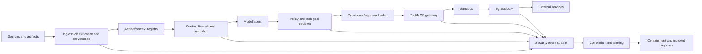

# AIwright Platform RFC — adversarial security review

> **Review date:** 2026-08-21  
> **Review target:** PRD v0.1, artifact architecture v0.1, security architecture v0.2, roadmap, and prior adversarial review  
> **Disposition:** Security direction is materially improved, but implementation remains blocked on concrete protocol, policy, and test artifacts.

## 1. Executive verdict

The proposed architecture now has the correct core stance: **do not try to make the model the security boundary**. Prompt-injection classifiers, system prompts, and model self-checks are useful signals, but they cannot authorize tools, secrets, network egress, artifact promotion, or high-impact actions.

The strongest architectural decisions are:

- task-bound and effect-limited capability grants;
- policy enforcement outside the model;
- artifact authority and context eligibility;
- instruction/data separation and taint propagation;
- Tool/MCP manifest integrity and reapproval;
- secret and egress brokers;
- restricted mode and emergency stop;
- security-event correlation rather than isolated warning strings.

However, the following failure modes remain realistic unless implemented as first-class contracts:

1. permission controls become broad role checks rather than resource/effect checks;
2. user confirmation becomes a rubber stamp;
3. injection detection is treated as proof of safety;
4. planning/design artifacts become a trusted poisoning path;
5. monitoring and alert payloads become a second data leak;
6. local collectors and traces bypass hosted security assumptions;
7. an approved MCP/tool changes after review;
8. model output reaches execution or rendering without typed validation;
9. incident containment depends on the agent cooperating;
10. security scope expands beyond what the MVP can test.

## 2. Review findings

### SEC-01 — Prompt injection cannot be solved by input filtering

**Severity:** Critical  
**Status:** Accepted; architectural invariant

Direct and indirect injection is increasingly closer to social engineering than a stable malicious-string signature. The attacker may use valid-looking business content, tool results, repository documents, issue comments, or generated artifacts rather than an obvious “ignore previous instructions” phrase.

#### Required disposition

- Treat classifiers and patterns as signals only.
- Assume some attacks pass detection.
- Apply least privilege, task binding, typed tools, egress policy, and approval independently.
- Block high-risk action paths based on authority and effect even when injection confidence is low.
- Test attacks that contain no explicit override language.

### SEC-02 — Source provenance is not equivalent to trust

**Severity:** Critical  
**Status:** Accepted; protocol blocker

A source can be correctly identified as “internal Git repository” and still be malicious, compromised, outdated, or generated without review. Provenance answers where content came from; authority answers whether it can control behavior.

#### Required disposition

- Keep `source`, `trust`, `authority`, `classification`, and `integrity` as separate fields.
- Internal files default to `working_internal` unless explicitly promoted.
- Imported and generated artifacts cannot grant instruction authority.
- Signed content proves origin/integrity, not semantic safety.

### SEC-03 — Planning and design artifacts are a high-leverage poisoning target

**Severity:** Critical  
**Status:** Accepted; artifact-gate blocker

A poisoned PRD, `AGENTS.md`, threat model, test plan, tool manifest, or runbook can affect many future tasks. Shared templates and skills have wider blast radius than one prompt.

#### Required disposition

- Artifact revisions are immutable and hashed.
- High-impact artifacts require review and, in managed mode, separation of author/approver.
- Context assembly loads only eligible current revisions.
- Generated summaries inherit source taint and classification.
- Promotion changes produce security/audit events.
- Shared artifact changes trigger dependent-project impact analysis.

### SEC-04 — RBAC alone will fail for agent actions

**Severity:** Critical  
**Status:** Accepted; authorization-spec blocker

A role such as `developer` or `project_agent` is too broad. Authorization must consider exact resource, action, purpose, task, environment, data class, requested effect, duration, and delegation chain.

#### Required disposition

Define a policy decision contract with at least:

```text
principal
delegator
task_id
action
resource
purpose
environment
data_classification
risk_tier
requested_effect
source_taint
expires_at
```

Create negative tests showing that the same agent can read one repository but not another, write only its task branch, and cannot convert branch access into merge/deploy access.

### SEC-05 — User approval can become security theater

**Severity:** High  
**Status:** Accepted; UX/security blocker

Repeated generic confirmation dialogs train users to approve without inspection. Attackers can also manipulate the explanation shown to the user.

#### Required disposition

The confirmation payload must be generated from the deterministic tool request and policy engine, not solely from model prose. It shows:

- target resource and external recipient;
- exact material arguments/changes;
- data classifications leaving the boundary;
- action risk and reversibility;
- permission duration;
- task-plan linkage;
- injection/taint warnings;
- safe alternative where available.

R5 actions need a separate trusted workflow or dual control, not a chat confirmation.

### SEC-06 — An approved MCP server can rug-pull after approval

**Severity:** Critical  
**Status:** Accepted; integration blocker

Tool descriptions, schemas, endpoints, packages, images, and OAuth scopes can change. A server approved as read-only can later introduce write/delete functions or alter output behavior.

#### Required disposition

- Pin and hash manifest/schema/package/image revisions.
- Compare observed manifest against approved revision before use.
- Quarantine material changes.
- Reapprove scope increases and privileged functions.
- Record publisher and distribution provenance.
- Support immediate server/tool disablement.

### SEC-07 — Token passthrough and audience confusion enable privilege abuse

**Severity:** Critical  
**Status:** Accepted; MCP/auth blocker

A connector or MCP proxy that accepts or forwards tokens intended for another resource can become a confused deputy.

#### Required disposition

- Validate token audience/resource on every request.
- Forbid token passthrough.
- Use a separate downstream token when calling third-party APIs.
- Use PKCE and exact redirect validation for public clients.
- Rotate refresh tokens where applicable.
- Test audience mismatch, replay, expiry, and scope challenge behavior.

### SEC-08 — Secrets must be excluded before context creation, not only before export

**Severity:** Critical  
**Status:** Accepted; P0 blocker

Once a credential enters model context, a trace, a compacted summary, a child-agent handoff, or a tool argument, later redaction cannot reliably remove every derived copy.

#### Required disposition

- Detect and intercept known secrets at ingestion/context assembly.
- Replace required credentials with opaque secret handles.
- Resolve values only inside the execution boundary.
- Redact stdout/stderr and structured tool output.
- Record access events without values.
- Rotate credentials when exposure is suspected.

### SEC-09 — Egress control must include rendering and indirect channels

**Severity:** Critical  
**Status:** Accepted; renderer/egress blocker

Sensitive data can leave through Markdown image URLs, HTML embeds, redirects, query strings, DNS, generated archives, source maps, logs, crash reports, or multiple small requests—not only a visible API POST.

#### Required disposition

- Disable direct remote fetch from generated Markdown/HTML.
- Use CSP and safe rendering.
- Apply URL/domain/query policy.
- Block local/cloud metadata ranges and SSRF.
- Inspect logs, alerts, exports, generated artifacts, and evaluation payloads as egress.
- Correlate fragmented/encoded transfers and unusual volume.

### SEC-10 — Output handling is a code-execution boundary

**Severity:** Critical  
**Status:** Accepted; implementation blocker

A prompt-injected model does not need direct shell access if its output is passed to `exec`, SQL, templates, HTML, path creation, package installation, or configuration loaders without validation.

#### Required disposition

- Typed tool APIs instead of free-form execution.
- Strict schemas and unknown-field rejection for privileged calls.
- Parameterized SQL/API calls.
- File path canonicalization and symlink protection.
- Context-aware escaping and rendering.
- No unreviewed dynamic package/source resolution.
- Sandbox and network restrictions remain mandatory.

### SEC-11 — Taint must follow derived content and child agents

**Severity:** High  
**Status:** Accepted; protocol blocker

A malicious external document may be summarized, placed into memory, added to a task plan, and passed to a child agent. If taint is cleared at each transformation, the final privileged request appears internal and clean.

#### Required disposition

- Context sources and artifacts carry derivation references.
- Summaries inherit relevant taint/classification.
- Child handoffs carry source and taint metadata.
- Taint is cleared only through an explicit deterministic or reviewed transformation.
- The same model cannot clear taint by declaring its own output safe.

### SEC-12 — Memory promotion is an authorization event

**Severity:** Critical  
**Status:** Accepted; memory blocker

Durable memory affects future contexts and may cross task boundaries. Automatically saving model conclusions or external content creates persistent poisoning and privacy risk.

#### Required disposition

- Memory uses draft/reviewed/canonical lifecycle.
- External/generated memory is never canonical automatically.
- Scope, expiry, provenance, classification, and correction/delete behavior are required.
- Security and identity assertions need stronger approval.
- Quarantine invalidates retrieval and derived indexes.

### SEC-13 — LLM evaluators are untrusted consumers and untrusted producers

**Severity:** High  
**Status:** Accepted; P1 blocker

Judge payloads can leak data to another provider and can contain injected instructions. Judge output can also manipulate scores, findings, or policy if trusted directly.

#### Required disposition

- Separate judge system rubric from evaluated content.
- No tools or network for baseline judges.
- Explicit provider/export policy.
- Bounded content and structured output schema.
- Deterministic parsing and failure handling.
- Version and calibrate against human labels.
- No judge result directly permits a privileged action or artifact promotion.

### SEC-14 — Multi-agent delegation can hide privilege expansion

**Severity:** Critical  
**Status:** Accepted; multi-agent blocker

A root agent may spawn children, transfer tasks, or ask another agent to perform an action it cannot perform directly. Shared credentials and ambiguous identities make audit ineffective.

#### Required disposition

- Distinct child identity and task.
- Child grant is a subset of parent grant.
- Peer agents cannot grant capability.
- Signed/recorded handoff and result edges.
- Permission and token revocation on close.
- Detect delegation chains that split one disallowed action into several allowed-looking steps.

### SEC-15 — Emergency stop must not be a natural-language message

**Severity:** Critical  
**Status:** Accepted; runtime blocker

An agent may ignore, misunderstand, or fail to receive “stop” text while processes and external actions continue.

#### Required disposition

- Out-of-band stop enforced by orchestrator/tool gateway/sandbox.
- Kill active processes and block new calls.
- Revoke capability grants and connector tokens.
- Disable egress and artifact/memory promotion.
- Scope stop to turn/run/task/agent/tool/project/tenant.
- Test stop effectiveness during long-running and nested operations.

### SEC-16 — Local mode has a high-density data exposure risk

**Severity:** Critical  
**Status:** Accepted; P0 blocker

Local rollout traces, JSONL events, content blobs, terminal output, paths, and environment-derived data can be more sensitive than the original chat. “Local” does not mean safe if permissions, backups, sync folders, malware, or support bundles expose the files.

#### Required disposition

- Restrictive file modes and private directories.
- Avoid cloud-synced default paths.
- Encryption option for local sensitive stores.
- Explicit TTL and cleanup.
- No secret values in indexes.
- Export preview.
- Clear warning when importing full rollout traces.
- Local data inventory and delete command.

### SEC-17 — Monitoring and alerting can leak the incident data

**Severity:** Critical  
**Status:** Accepted; monitoring blocker

Copying suspicious prompts, credentials, source fragments, or customer data into Slack/SIEM/email alerts expands exposure and retention.

#### Required disposition

- Alerts carry IDs, hashes, classifications, destinations, rule versions, and bounded redacted summaries.
- Raw evidence is retrieved separately under audited permission.
- Alert destinations follow provider/export policy.
- Prevent log/alert injection and terminal control sequences.
- Apply retention and deletion policy to incident data.

### SEC-18 — Anomaly detection may reproduce surveillance and bias

**Severity:** High  
**Status:** Accepted; governance constraint

Behavioral baselines can turn into employee monitoring or incorrectly penalize unusual but legitimate work. Named individual rankings also create incentives to game the telemetry.

#### Required disposition

- Use anomaly models to prioritize technical security review, not employee evaluation.
- Prefer task/action/resource baselines over “productive user” scores.
- Explain signal sources and confidence.
- Support correction/appeal.
- Aggregate team views and suppress small cohorts.
- Restrict access to individual security activity.

### SEC-19 — Audit integrity can create false confidence

**Severity:** High  
**Status:** Accepted; control-plane blocker

An append-only table is not sufficient if clocks, sequence, actor identity, policy versions, or external tool evidence are missing. Attackers may also delete content while leaving misleading metadata.

#### Required disposition

- Sequence and clock integrity checks.
- Immutable policy/evaluator references.
- Actor/workload identity on every privileged event.
- Content hashes and optional signed batches.
- Detect missing expected audit events.
- Separate audit administration and investigation access.
- Preserve minimal proof of deletion/retention actions.

### SEC-20 — Supply-chain scope includes prompts, skills, datasets, and tool metadata

**Severity:** Critical  
**Status:** Accepted; release blocker

Traditional dependency scanners will not catch poisoned prompt fragments, skill packages, evaluation datasets, MCP descriptions, model routes, or copied “leaked” agent tools.

#### Required disposition

- Treat non-code AI assets as supply-chain artifacts.
- Maintain hashes, publisher/source, review status, and compatibility.
- Generate SBOM/AIBOM where practical.
- Pin dependencies and container images.
- Sign releases and verify provenance.
- Scan/inspect new prompt/skill/tool/dataset revisions.
- Quarantine unofficial mirrors and suspicious release assets.

### SEC-21 — Rate and budget limits are security controls

**Severity:** High  
**Status:** Accepted; P0/P1 requirement

Unbounded loops can create denial of service, cost exhaustion, excessive data access, and repeated external side effects.

#### Required disposition

- Per-task and per-actor model/tool/token/time budgets.
- Maximum affected-resource counts.
- External-send and destructive-action rate limits.
- Loop and retry detection.
- Hard stop thresholds independent from model cooperation.
- Distinguish user-configured budget extension from agent self-extension.

### SEC-22 — Incident recovery can reintroduce poisoned state

**Severity:** High  
**Status:** Accepted; runbook blocker

Restarting a run with the same memory, context pack, artifact revision, tool manifest, or token may recreate the incident.

#### Required disposition

Recovery requires:

- clean context snapshot;
- quarantined source exclusion;
- credential/token rotation verification;
- tool/artifact integrity revalidation;
- permission regrant from minimum baseline;
- affected outcome reclassification;
- regression fixture creation;
- observation window before full restoration.

### SEC-23 — Cross-tenant and insider access are separate threats

**Severity:** Critical  
**Status:** Open; hosted-platform blocker

Strong tenant isolation does not prevent an authorized administrator or manager from over-accessing raw prompts and incident evidence.

#### Required disposition

- Tenant/project/classification-scoped content access.
- Raw-content permission separated from dashboard permission.
- Just-in-time access and reason capture.
- Break-glass workflow and notification.
- Access anomaly monitoring.
- Small-cohort suppression and anti-ranking policy.
- Periodic privileged-access review.

### SEC-24 — Security controls need a failure-mode policy

**Severity:** Critical  
**Status:** Open; architecture blocker

If the policy engine, scanner, artifact registry, audit sink, or egress gateway is unavailable, the system must know whether to fail closed, fail open in restricted mode, or stop collection without stopping the host task.

#### Required disposition

Define per-control failure behavior:

| Control | Failure behavior |
|---|---|
| Collector/analytics export | Host task continues; telemetry marked incomplete |
| Secret broker | Secret-dependent action fails closed |
| Permission/PDP | R2+ access and R3+ actions fail closed |
| Artifact authority/integrity | Automatic context loading fails closed |
| Prompt-injection classifier | Continue only under normal authority controls; do not claim clean result |
| Egress/DLP gateway | External transmission fails closed |
| Audit sink | Privileged actions pause or use bounded local durable spool |
| Alert delivery | Containment remains active; delivery retries without raw payload expansion |

## 3. Security-control priority

### P0 — required before local pilot use on real repositories

1. Artifact manifests and authority state.
2. Context source/trust/classification labels.
3. Secret exclusion before context/export.
4. Supported-tool risk classification and deterministic permission checks.
5. Restricted mode.
6. Output/path/command validation.
7. Local private storage, inventory, and deletion.
8. Export preview and provider policy.
9. Emergency stop.
10. Security events and local report.
11. Prompt-injection, exfiltration, path, output-rendering, and stop fixtures.
12. Defined fail-open/fail-closed behavior.

### P1 — required before credentialed MCP and external actions

1. Capability grants and approval broker.
2. MCP/tool trust manifest and change quarantine.
3. OAuth audience validation and no token passthrough.
4. Secret broker.
5. Egress proxy/DLP.
6. Multi-agent delegation policy.
7. Evaluator isolation.
8. Correlated alerting and incident runbook.
9. Supply-chain and signed artifact controls.

### P2 — required before hosted/team operation

1. Tenant/project authorization and KMS separation.
2. Audited raw-content access and JIT privileges.
3. Retention/deletion verification.
4. SIEM/on-call integration with redacted events.
5. Insider-access monitoring.
6. Incident case management and drills.
7. Backup/recovery and tenant-isolation adversarial tests.
8. Privacy/cohort governance.

## 4. Required new artifacts before implementation

The following artifacts now block implementation repository bootstrap:

1. `SECURITY_CONTROL_MATRIX` mapping threats to enforcement points, tests, owners, and phases.
2. `PERMISSION_MATRIX` for supported Codex commands, filesystem, Git, network, and MCP actions.
3. `DATA_CLASSIFICATION` and model/provider/export policy.
4. `ABUSE_CASE_CATALOG` including prompt injection, exfiltration, goal hijack, memory poisoning, tool changes, and evaluator attacks.
5. `FAILURE_MODE_POLICY` for each critical control.
6. `SECURITY_EVENT_SCHEMA` and alert-routing matrix.
7. `INCIDENT_RESPONSE_PLAN` with emergency-stop and credential/tool quarantine procedures.
8. `MCP_TOOL_TRUST_RECORD` schema.
9. `RED_TEAM_PLAN` and fixture inventory.
10. `LOCAL_DATA_HANDLING` design for paths, permissions, encryption, TTL, inventory, and deletion.

## 5. Recommended architecture amendments

The logical runtime pipeline should be interpreted as:



No arrow from `MODEL` may bypass the policy, tool, sandbox, and egress layers for consequential actions.

## 6. Final security decision

**Proceed to artifact schemas, permission/control matrices, failure-mode policy, threat model, and red-team fixture design. Do not proceed directly to full collector or dashboard implementation.**

The security architecture is now directionally sound. The next risk is implementation dilution: replacing task-scoped capabilities with broad roles, replacing egress controls with a prompt warning, or replacing incident response with log messages. The next phase must convert every critical control into a schema, deterministic policy, negative test, and explicit owner before any real credentials or sensitive repositories are connected.

## 7. Reference baseline reviewed

- OWASP GenAI LLM Top 10 2026, published 2026-08-03.
- OWASP Top 10 for Agentic Applications 2026.
- OWASP GenAI Incident Response Guide 1.0.
- NIST AI RMF Generative AI Profile, NIST AI 600-1.
- NIST Cyber AI Profile, IR 8596 preliminary draft.
- OpenAI prompt-injection and agent-design security guidance, 2025–2026.
- MCP authorization specifications and consent/tool-safety principles.
