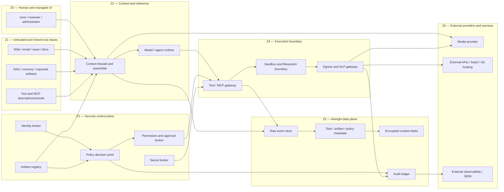

# AIwright Platform — security architecture and control plane

> **Status:** Draft / normative RFC extension  
> **Version:** 0.2  
> **Date:** 2026-08-21  
> **Scope:** Local collectors, hosted control plane, model context, tools/MCP, artifacts, evaluations, exports, monitoring, and response

## 1. Security position

AIwright Platform must assume that:

- a model can be manipulated by direct or indirect prompt injection;
- trusted-looking content can contain malicious or conflicting instructions;
- model output is untrusted input to every downstream component;
- a user confirmation can be rushed, misleading, or uninformed;
- tools, MCP servers, models, prompts, skills, packages, and external data can change after initial review;
- redaction and classifiers will miss some sensitive data;
- an agent with excessive permissions can cause damage even without an attacker;
- monitoring data and evaluation payloads can themselves become leakage channels.

Prompt-injection detection is therefore a signal, not the primary security boundary. The enforceable security boundary must sit **outside the model** in deterministic identity, policy, permission, tool, sandbox, data-flow, and egress controls.

The governing rule is:

> Assume the model may eventually follow a malicious instruction. Limit what the resulting action can read, change, execute, or transmit.

## 2. Security goals

### SG-01 Intent integrity

Actions must remain bound to the declared task, approved plan, and active user intent. External content cannot acquire instruction authority merely by entering model context.

### SG-02 Least authority

Each human, agent, tool, evaluator, and connector receives the smallest function, resource scope, duration, and autonomy required for the current task.

### SG-03 Data confidentiality

Sensitive prompts, artifacts, credentials, tool outputs, traces, and evaluations must not cross a provider, project, tenant, or network boundary without an explicit policy decision.

### SG-04 Artifact and evidence integrity

Planning documents, skills, policies, tool manifests, evidence, and evaluation results must have provenance, immutable revision identity, integrity checks, and promotion controls.

### SG-05 Safe execution

Model output must not directly become shell, SQL, HTML, URL, file path, policy, or external side-effect execution without typed validation and policy enforcement.

### SG-06 Detectability and containment

Suspicious context, permission escalation, tool misuse, exfiltration, integrity failure, and cross-boundary access must generate correlated security events and bounded response actions.

### SG-07 User and organizational control

Users and administrators must be able to inspect collection, permissions, approvals, blocked actions, content access, retention, and incident state without relying on opaque model explanations.

### SG-08 Privacy-preserving observability

Security monitoring must capture enough evidence to investigate an incident without automatically duplicating raw secrets or confidential content into alerts and logs.

## 3. Protected assets

| Asset | Examples | Primary risks |
|---|---|---|
| User intent and task contract | goals, acceptance criteria, constraints | goal hijack, silent scope drift |
| Instruction layers | system/developer rules, `AGENTS.md`, skills, prompt fragments | prompt injection, stale policy, privilege manipulation |
| Context sources | web, email, issue, file, RAG, tool output, memory | indirect injection, poisoning, sensitive disclosure |
| Credentials and identities | API keys, OAuth tokens, SSH keys, workload identity | theft, replay, token passthrough, privilege abuse |
| Tool capabilities | shell, filesystem, GitHub, email, calendar, DB, cloud | excessive agency, destructive action, lateral movement |
| Planning/design artifacts | PRD, threat model, permission matrix, runbook | artifact poisoning, unauthorized promotion |
| Implementation artifacts | code, patches, schemas, deployments | RCE, supply-chain compromise, integrity loss |
| Evidence and evaluations | tests, reviews, judge results, findings | fabricated validation, evaluator injection |
| Raw traces and telemetry | prompts, responses, paths, terminal output | high-density data leakage |
| Tenant/project boundaries | users, projects, organizations | cross-tenant access, surveillance |
| Security policy and audit | permission decisions, retention rules, alerts | tampering, deletion, bypass |

## 4. Trust zones and enforcement boundaries



### 4.1 Required policy-enforcement points

| Enforcement point | Controls |
|---|---|
| Input ingestion | source identity, classification, size/type limits, malware and secret checks |
| Context assembly | instruction/data separation, trust labels, artifact authority, provider policy, taint propagation |
| Model invocation | provider allowlist, content mode, data minimization, budget, external-export decision |
| Tool selection | capability allowlist, task relevance, action-risk classification |
| Tool invocation | actor identity, resource/action scope, arguments, approval, rate limit, sandbox |
| Network egress | domain/provider allowlist, DLP, payload filtering, encoded-exfiltration checks |
| Output rendering | HTML/Markdown/URL sanitization, CSP, remote-resource policy |
| Artifact promotion | provenance, integrity, review, unresolved findings, separation of duties |
| Evaluation | untrusted payload isolation, judge export policy, structured output validation |
| Data access | tenant/project/classification authorization, audited raw-content access |
| Alerting/export | redacted event schema, destination policy, minimum necessary evidence |

A security decision produced only as natural-language model output is advisory and cannot substitute for these enforcement points.

## 5. Identity and authorization model

### 5.1 Actor identities

Every operation has an explicit actor:

```text
human_user
human_reviewer
human_admin
agent_root
agent_child
evaluator
collector
adapter
connector
tool_service
policy_engine
```

Agents and services must not reuse the user's analytics identifier as an execution identity. Execution identities are short-lived, task-scoped, and auditable.

### 5.2 Hybrid authorization

- **RBAC** defines administrative responsibilities and coarse project access.
- **ABAC** evaluates tenant, project, task, data classification, provider, environment, purpose, and risk.
- **Capability grants** authorize concrete tool actions and resource scopes.
- **Approval policy** determines whether an action is automatic, user-confirmed, dual-approved, or forbidden.

Example decision input:

```json
{
  "principal": "agent_run_01J...",
  "delegated_by": "actor_tom",
  "task_id": "task_auth_refactor",
  "action": "repository.branch.write",
  "resource": "repo:example/api#branch:ai/task-auth-refactor",
  "purpose": "implement_approved_task",
  "data_classification": "internal",
  "risk_tier": "R3",
  "requested_effect": {
    "max_files": 20,
    "protected_branch": false,
    "external_publish": false
  },
  "expires_at": "2026-08-21T08:00:00Z"
}
```

### 5.3 Permission properties

Every grant should be:

- actor-bound;
- task-bound;
- action-bound;
- resource-bound;
- purpose-bound;
- environment-bound;
- time-bound;
- effect-limited;
- revocable;
- non-transitive by default.

A child agent cannot receive permissions broader than its parent. Delegation creates a new grant with a smaller or equal capability set.

### 5.4 Action-risk tiers

| Tier | Typical action | Default policy |
|---|---|---|
| `R0` | Read public metadata or approved local fixtures | Allow and audit |
| `R1` | Read internal non-sensitive project content | Allow within task scope |
| `R2` | Read confidential content, raw prompts, source code, customer-linked data | Explicit content policy; often local/private provider only |
| `R3` | Reversible write: draft, branch, patch, temporary record | Scoped grant; dry-run or diff preview where possible |
| `R4` | Consequential external action: send, publish, merge, deploy, delete, access change | Hard approval with transaction summary; rollback/staging required |
| `R5` | Privileged/admin/security/credential/financial action | Default deny; step-up authentication and dual control or separate trusted workflow |

Risk classification is based on effect, not the tool name. A generic HTTP tool can become R5 depending on endpoint, payload, and identity.

### 5.5 Approval modes

```text
deny
auto_allow_within_sandbox
allow_read_only
allow_once
allow_until_expiry
require_user_confirmation
require_security_approval
require_dual_approval
break_glass
```

A confirmation dialog must show:

- exact action and resource;
- important arguments and changed fields;
- data leaving the current boundary;
- recipient/domain/provider;
- reversibility and rollback option;
- permission duration;
- why the action is needed for the task;
- prompt-injection or policy warnings that influenced the decision.

A generic “Allow tool?” prompt is insufficient for high-risk actions.

## 6. MCP and connector authorization

### 6.1 Required controls

For HTTP MCP and similar connectors:

- OAuth 2.1-compatible authorization;
- PKCE for public/local clients;
- exact redirect-URI validation;
- short-lived access tokens;
- refresh-token rotation where applicable;
- resource/audience binding;
- no token in query strings;
- no token passthrough to downstream services;
- separate downstream tokens when an MCP server calls another API;
- secure token storage outside model context;
- 401 for invalid/expired identity and 403 for insufficient scope;
- per-server and, where required, per-tool authorization;
- tool capability and scope metadata recorded in the artifact registry.

### 6.2 Tool manifest integrity

MCP/tool descriptions and schemas are untrusted until approved. The platform should record:

- server identity and publisher;
- package/image/release digest;
- transport endpoint;
- tool names, descriptions, input/output schemas, and annotations;
- required scopes;
- data destinations;
- network and filesystem requirements;
- approval revision and hash;
- last observed revision;
- vulnerability and deprecation status.

If a tool description, schema, endpoint, package digest, or scope changes after approval, the server enters `changed_unreviewed` or `quarantined` state. Privileged use is blocked until reapproval. This mitigates MCP rug-pull and supply-chain changes.

### 6.3 Credential handling

Credentials must never be requested through a normal LLM prompt or stored in model-visible memory. Use an out-of-band authorization flow or secret broker that returns an opaque handle. Possession of a handle is not authorization; every use is checked against identity, task, resource, expiry, and policy.

## 7. Prompt-injection and goal-hijack defenses

### 7.1 Threat sources

Prompt injection can arrive through:

- direct user input;
- websites and search results;
- email and calendar content;
- issue/PR comments and commit messages;
- repository files, code comments, generated documentation, and package metadata;
- RAG documents and embeddings;
- images, alt text, OCR text, or hidden document layers;
- tool descriptions, schemas, and tool results;
- MCP/A2A peer-agent messages;
- memory and prior-session summaries;
- copied terminal output and logs;
- evaluator inputs and evaluation datasets;
- AI-generated planning/design artifacts.

The architecture must not equate “internal” with “trusted.” A compromised internal artifact may be more dangerous because it receives higher implicit trust.

### 7.2 Layered control sequence

```mermaid
flowchart LR
    S[Source content] --> P[Provenance and trust label]
    P --> C[Classification and static checks]
    C --> I[Instruction/data boundary]
    I --> T[Taint and information-flow tracking]
    T --> G[Task-goal and plan binding]
    G --> A[Authorization and action-risk check]
    A --> V[Typed argument validation]
    V --> X[Sandbox and egress control]
    X --> O[Output sanitization]
    O --> M[Monitoring and response]
```



### 7.3 Source provenance and trust labels

Suggested trust states:

```text
trusted_control
reviewed_internal
working_internal
user_supplied
external_untrusted
tool_untrusted
generated_unreviewed
quarantined
unknown
```

Trust affects instruction eligibility, not factual truth. A `trusted_control` may supply instructions, while an `external_untrusted` document is data to analyze. The model receives explicit source boundaries and provenance metadata, but enforcement must not rely on the model respecting those labels.

### 7.4 Instruction/data separation

- Preserve distinct system, project, skill, task, user, external-data, and tool-output layers.
- Do not concatenate all content into one undifferentiated prompt.
- External content cannot create or modify permission grants.
- Instructions found inside retrieved data are not executable instructions unless a trusted human or policy promotes them.
- Generated summaries inherit the lowest relevant trust and classification of their sources.
- Context compaction must preserve trusted security constraints and source boundaries.

### 7.5 Detection and classification

Detection may combine:

- deterministic patterns for instruction override, secret discovery, encoded exfiltration, and tool manipulation;
- content-source and trust anomalies;
- classifier/model-based prompt-injection scoring;
- known attack signatures and threat-intelligence updates;
- unusual instruction density inside data artifacts;
- mismatch between source type and requested action;
- hidden/obfuscated content detection;
- canary or honeytoken access where appropriate.

Detection alone must not grant safety. Low-confidence detection can move a run to restricted mode; high-risk action authorization remains independently enforced even when no injection is detected.

### 7.6 Taint and information-flow tracking

Mark content as tainted when it originates from external, generated-unreviewed, quarantined, or injection-suspected sources.

Track whether a proposed action's arguments or payload derive from tainted content. Examples:

- external page text influences an email recipient;
- issue comment influences a shell command;
- tool output influences a permission change;
- retrieved document influences an external URL;
- unreviewed artifact influences a deploy action.

Policy examples:

```text
TAINTED + R0/R1 read-only analysis        -> allow in restricted context
TAINTED + R3 reversible local write       -> preview and explicit approval
TAINTED + R4 external/destructive action   -> block by default
TAINTED + secret/confidential egress       -> block and alert
TAINTED + R5 privileged action             -> deny
```

Taint is cleared only by a defined deterministic transformation or authorized review, never by the same model asserting that content is safe.

### 7.7 Goal and plan binding

Before a tool action, compare:

- task intent;
- approved plan step;
- requested tool action;
- target resource;
- data read or transmitted;
- expected effect.

A significant semantic or structural deviation creates `goal_hijack_suspected`. High-risk execution is blocked pending review. The comparison can use deterministic constraints plus a semantic evaluator, but the final permit/deny policy remains deterministic.

### 7.8 Restricted mode

When prompt injection is suspected but not confirmed, the run may enter a constrained mode:

- read-only tools;
- no secret access;
- no external network except approved research domains;
- no credentialed sessions;
- no R4/R5 actions;
- no artifact promotion;
- no memory write;
- user-visible warning and evidence references;
- explicit clean-context restart option.

## 8. Sensitive-data protection and egress control

### 8.1 Data classification

| Class | Examples | Default model/provider policy |
|---|---|---|
| `C0_PUBLIC` | public documentation, published source | Approved providers allowed |
| `C1_INTERNAL` | normal internal code/docs without high sensitivity | Approved enterprise/local providers; managed logging minimized |
| `C2_CONFIDENTIAL` | customer data, proprietary design, unreleased product data | Local/private or explicitly approved provider; redaction/minimization required |
| `C3_RESTRICTED` | regulated data, security architecture, incident evidence, production secrets context | Local/private processing unless exception approved |
| `C4_SECRET` | passwords, API keys, private keys, session tokens, recovery codes | Never enter model context; secret broker only |

Classification is attached to messages, artifacts, context sources, tool arguments, outputs, traces, and exports.

### 8.2 Egress channels

Controls must cover more than model API calls:

- model-provider requests;
- MCP/tool API calls;
- web requests, redirects, DNS, and URL query parameters;
- Markdown images, embeds, and remote fonts;
- rendered HTML/JavaScript;
- email, chat, issue, PR, and publishing tools;
- generated files, archives, source maps, packages, and release artifacts;
- logs, metrics, traces, alerts, crash reports, and support bundles;
- clipboard or desktop automation;
- external evaluation providers;
- observability and SIEM exports.

### 8.3 Egress gateway

The gateway evaluates:

- destination domain/provider and trust;
- task and user authorization;
- data classification and taint;
- payload type, size, and encoding;
- secret/PII/proprietary-data matches;
- unusual compression, base64, steganographic, or high-entropy content;
- query-string leakage;
- repeated small transfers that may form a covert channel;
- whether the destination is necessary for the task;
- whether a user-visible disclosure preview is required.

Controls:

- default-deny network policy for sandboxed agents;
- explicit domain allowlists;
- outbound proxy with request logging and redacted evidence;
- URL normalization and query scrubbing;
- body and response size caps;
- block remote image auto-fetch from generated Markdown;
- CSP and safe renderer configuration;
- DNS and IP-range restrictions including local/metadata endpoints;
- SSRF protections;
- rate and volume limits;
- provider-specific content policies.

### 8.4 Secret broker

- Secrets remain outside prompts, context packs, raw traces, and normal tool output.
- The broker resolves an opaque secret reference only inside the execution boundary.
- Tools receive the minimum credential scope and lifetime.
- Secret values are redacted from stdout/stderr and structured outputs.
- Secret access generates an audited event without logging the value.
- Suspicious secret enumeration or repeated denial triggers containment.

### 8.5 Redaction limits

Redaction is defense in depth, not a guarantee. The product must expose:

- which rules and classifier versions ran;
- what content categories were removed;
- unresolved or unsupported file types;
- residual-risk warnings;
- an export preview for local mode;
- the policy decision that permitted managed export.

## 9. Safe tool and output execution

### 9.1 Tool input controls

- typed schemas and strict parsers;
- reject unknown fields for privileged calls;
- canonicalize file paths and detect traversal/symlink escapes;
- parameterized SQL and API requests;
- no `eval` or dynamic code execution from natural-language output;
- command allowlists or structured command builders;
- environment and working-directory restrictions;
- resource limits and timeouts;
- target-resource validation;
- dry-run/diff preview for reversible writes;
- idempotency keys for external actions;
- maximum affected-resource counts.

### 9.2 Output handling

Treat model and tool output as untrusted:

- escape HTML and context-specific output;
- sanitize Markdown and links;
- disable or proxy remote resource rendering;
- do not execute generated SQL, shell, JavaScript, templates, or file paths directly;
- verify generated package names and sources;
- scan generated archives and binaries;
- validate structured outputs against schema;
- strip terminal control sequences where logs are rendered;
- enforce content-disposition and MIME handling;
- prevent log forging and alert injection.

### 9.3 Sandboxing

The execution sandbox should support:

- task-specific filesystem roots;
- read-only mounts by default;
- explicit writable paths;
- no host Docker/socket access by default;
- isolated process, user, and network namespaces where available;
- resource quotas;
- blocked cloud metadata endpoints;
- no inherited broad environment variables;
- ephemeral workspace and cleanup;
- branch/worktree isolation for code changes;
- network disabled unless explicitly required;
- observable process tree and outbound connections;
- immediate termination through emergency stop.

A sandbox reduces blast radius; it does not make unsafe commands acceptable.

## 10. Multi-agent, memory, and context-compaction security

### 10.1 Multi-agent delegation

- Each child agent has a distinct identity and task.
- The parent supplies a signed/recorded handoff containing purpose, allowed artifacts, expected output, permissions, and expiry.
- Child capability is a subset of parent capability.
- Peer agents cannot grant permissions to one another.
- Child output is untrusted until validated.
- Agent result and notification edges preserve source identity.
- Closing a child revokes its unconsumed capability grants.
- Multi-agent actions are correlated under one root task and incident scope.

### 10.2 Memory security

Memory entries use the artifact lifecycle:

```text
captured -> proposed -> reviewed -> approved/canonical -> expired/deprecated
```

- External or generated content cannot become durable memory automatically.
- Memory stores provenance, classification, tenant/project scope, confidence, and expiry.
- Security constraints and identity claims require stronger approval than preferences.
- Retrieval filters by task, tenant, classification, and authority.
- Poisoned or disputed memory can be quarantined and excluded from all future context.
- Memory deletion and correction propagate to derived indexes and summaries.

### 10.3 Context compaction

Compaction must record:

- source context snapshot;
- summarizer/evaluator version;
- preserved and omitted artifact references;
- security-constraint retention result;
- classification and taint inheritance;
- confidence and known loss.

A compacted summary cannot silently downgrade classification or authority.

## 11. Security events, monitoring, and alerting

### 11.1 Security event schema

```json
{
  "event_type": "security.egress.blocked",
  "severity": "P1_HIGH",
  "occurred_at": "2026-08-21T06:00:00Z",
  "scope": {
    "tenant_id": null,
    "project_id": "project_...",
    "task_id": "task_...",
    "run_id": "run_...",
    "actor_id": "agent_run_..."
  },
  "signal": {
    "rule_id": "egress-confidential-unapproved-domain",
    "rule_version": "0.2.0",
    "confidence": 0.99,
    "data_classification": "C2_CONFIDENTIAL",
    "taint": ["external_untrusted"]
  },
  "decision": {
    "result": "deny",
    "policy_id": "policy_egress_v3",
    "enforcement_point": "egress_gateway"
  },
  "evidence_refs": ["evt_tool_12", "artifact_context_4"],
  "content_preview": null,
  "response_actions": ["terminate_request", "enter_restricted_mode", "notify_user"]
}
```

Security logs should reference evidence rather than copy sensitive payload bodies.

### 11.2 Initial detection catalog

| Signal | Example condition | Default response |
|---|---|---|
| `prompt_injection.suspected` | instruction-like content in external/tool data, obfuscation, known patterns | Mark taint; restricted mode or warning based on risk |
| `goal_hijack.suspected` | tool action materially deviates from task/plan | Block R3+; request review |
| `secret.detected` | credential pattern or high-confidence secret classifier | Redact; block export; notify owner |
| `sensitive_egress.attempted` | C2+ data to unapproved provider/domain | Block and alert |
| `permission.escalation.requested` | agent requests broader scope than task grant | Deny or step-up approval |
| `tool_sequence.anomalous` | broad sensitive read followed by external send/archive | Pause/kill run; P1/P0 investigation |
| `bulk_access.anomalous` | unexpected file, record, mailbox, or tenant enumeration | Rate limit; block; notify |
| `mcp_manifest.changed` | approved tool schema/description/digest changed | Quarantine tool/server |
| `token.audience_mismatch` | token not issued for target resource | Block; revoke or rotate; P1 |
| `token.replay.suspected` | token reused from new actor/environment | Revoke; investigate |
| `artifact.integrity.failed` | content hash/signature mismatch | Quarantine artifact and dependent context |
| `artifact.poisoning.suspected` | unreviewed artifact attempts instruction/permission authority | Block promotion/context authority |
| `evaluator_injection.suspected` | evaluation payload tries to modify rubric or output contract | Fail evaluation; quarantine case |
| `sandbox.violation` | path escape, prohibited process, metadata access | Terminate run; P0/P1 |
| `unexpected_code_execution` | interpreter/shell process outside allowed plan | Terminate; preserve evidence |
| `cross_tenant_access.denied` | actor requests another tenant/project resource | Block; P0 security incident |
| `audit_gap.detected` | privileged action lacks expected policy/audit record | Freeze affected workflow |
| `rate_or_budget.exceeded` | loop, token, tool, or egress threshold exceeded | Stop/throttle; notify |
| `emergency_stop.activated` | user/admin/automatic containment | Revoke grants; terminate execution |

### 11.3 Severity and action policy

| Severity | Definition | Required response |
|---|---|---|
| `P0_CRITICAL` | confirmed/likely cross-tenant exposure, credential theft, RCE, destructive privileged action, active exfiltration | Immediate block/isolation, token revocation, export freeze, security paging, incident creation |
| `P1_HIGH` | high-confidence injection tied to sensitive action, secret exposure, integrity failure, privilege abuse | Block action, restrict run, notify user/security owner, preserve evidence |
| `P2_MEDIUM` | suspicious content or behavioral anomaly with limited current capability | Warn, reduce permissions, require approval, monitor correlation |
| `P3_LOW` | policy deviation or weak signal without consequential access | Audit, deduplicate, include in post-session review |
| `P4_INFO` | expected security decision or normal control event | Audit only |

### 11.4 Alert routing

- local user for task-level blocks and confirmations;
- project security owner for P1+ project incidents;
- tenant security/operations for P0 and repeated P1;
- tool/MCP owner for manifest or integration integrity changes;
- privacy owner for managed-content and retention violations;
- SIEM/on-call integration only after redaction and destination policy.

Alerts must be deduplicated and correlated by task/run/actor/destination. Repeated generic warnings are suppressed or summarized to prevent alert fatigue.

### 11.5 Behavioral correlation

High-value detections usually require a sequence rather than one prompt:

```text
untrusted content read
  -> sensitive repository enumeration
  -> archive/compression
  -> new external domain request
  -> encoded payload
```

or:

```text
MCP manifest changes
  -> new privileged scope requested
  -> child agent spawned
  -> destructive call without expected plan step
```

The correlation engine should combine deterministic rules, policy context, artifact provenance, and optional anomaly models. An anomaly model may prioritize review but cannot independently grant permission.

### 11.6 Monitoring guardrails

- no raw secret values in alerts;
- no unbounded prompt/output logging;
- classification-aware retention;
- access-audited investigation views;
- tamper-evident policy and action records;
- clock and sequence integrity checks;
- false-positive and dismissal tracking;
- ruleset/version provenance;
- monitoring disablement or gaps produce visible control-health findings.

## 12. Emergency response and incident lifecycle

### 12.1 Emergency stop scopes

```text
turn
run
session
task
agent identity
tool or MCP server
project adapter
provider export
tenant
```

Emergency stop must be enforced outside the model and remain effective even if the agent ignores a stop message.

### 12.2 Automatic containment actions

- terminate active tool processes;
- revoke task and child-agent grants;
- revoke/rotate connector tokens;
- disable network egress;
- freeze artifact promotion and memory writes;
- disable affected MCP/tool manifest;
- stop managed content export;
- snapshot hashes, policy decisions, process/network metadata, and evidence references;
- preserve a bounded incident evidence bundle;
- notify authorized responders.

### 12.3 Incident states

```text
suspected
  -> triaged
  -> contained
  -> investigated
  -> eradicated
  -> recovered
  -> monitored
  -> closed
```

Every transition records actor, evidence, rationale, and residual risk.

### 12.4 Recovery requirements

- clean context restart;
- credential rotation verification;
- artifact/tool integrity revalidation;
- affected task/outcome reclassification;
- data-recipient and access review;
- controlled restoration of permissions;
- user notification where applicable;
- post-incident evaluator/rule updates;
- regression fixture and red-team case creation;
- documented lessons without automatically promoting unverified conclusions.

## 13. Audit and tamper resistance

Audit must cover:

- identity authentication;
- permission grants and revocations;
- approval prompts and decisions;
- policy decisions and rule versions;
- raw-content access;
- artifact promotion and context loading;
- tool/MCP manifest changes;
- secret access;
- provider and data exports;
- security alerts and response actions;
- incident transitions;
- retention and deletion jobs;
- break-glass access.

Controls:

- append-only event IDs and sequence checks;
- content hashes and optional signed batches;
- immutable policy/evaluator version references;
- restricted audit administration;
- retention appropriate to classification and legal policy;
- no audit deletion by the same identity being investigated;
- verifiable deletion of content while retaining minimal non-sensitive compliance records where required.

## 14. Supply-chain security

The platform depends on models, SDKs, MCP servers, tools, packages, containers, prompt fragments, skills, evaluation datasets, and artifact templates.

Required controls:

- pinned versions and digests;
- dependency and container scanning;
- SBOM/AIBOM generation where practical;
- signed releases and provenance attestations;
- approved registries and package sources;
- quarantine of unverified binaries and “leaked” mirrors;
- tool/MCP manifest diff and reapproval;
- vulnerability and end-of-life tracking;
- restricted installation permissions;
- sandboxed evaluation of new integrations;
- rollback to last approved revision;
- explicit trust records for external prompt/skill/template sources.

## 15. Security testing and adversarial evaluation

### 15.1 Prompt-injection corpus

Include at least:

- direct override and jailbreak attempts;
- indirect web/email/document instructions;
- multilingual and obfuscated text;
- base64, Unicode, whitespace, markup, and encoded payloads;
- Markdown image and URL-query exfiltration;
- hidden document layers and image text;
- repository issue/comment/code-instruction attacks;
- malicious tool descriptions and results;
- MCP rug-pull and changed schema;
- RAG and memory poisoning;
- task/plan goal hijack;
- evaluator and rubric injection;
- child-agent and peer-agent spoofing;
- user-confirmation manipulation.

### 15.2 Authorization and execution tests

- negative tests for every R3/R4/R5 action;
- child permission cannot exceed parent;
- task expiry and revocation;
- audience mismatch and token passthrough rejection;
- cross-project and cross-tenant denial;
- symlink/path traversal;
- SSRF and metadata endpoint access;
- sandbox escape attempts;
- command/SQL/template injection;
- bulk read and rate-limit enforcement;
- emergency-stop effectiveness;
- rollback/reversibility tests.

### 15.3 Data protection tests

- C0–C4 classification fixtures;
- known and synthetic secrets;
- encoded or fragmented secret exfiltration;
- logs, alerts, crash dumps, and support bundles;
- raw trace and rollout bundle permissions;
- retention/deletion propagation;
- model-provider and judge-provider export policies;
- remote Markdown/HTML rendering;
- content-preview accuracy and residual-risk disclosure.

### 15.4 Operational exercises

- prompt-injection incident drill;
- compromised MCP/tool drill;
- token theft/replay drill;
- cross-tenant denial and investigation drill;
- malicious artifact/memory rollback;
- provider export shutdown;
- backup/restore with audit integrity;
- evaluator compromise and dataset quarantine.

## 16. Phased implementation

### P0 — local Codex pilot

Required:

- source/trust/classification labels;
- planning/design artifact manifests;
- local content modes and restrictive filesystem permissions;
- secret scanning before export;
- context snapshots with artifact/source references;
- tool action-risk classification;
- deterministic permission checks for supported commands/tools;
- explicit export preview;
- no external LLM judge by default;
- restricted mode;
- emergency stop;
- local security-event report;
- prompt-injection, secret, output-rendering, and path/command fixtures.

Not required in P0:

- full enterprise SIEM integration;
- generalized real-time DLP for every binary type;
- organization-wide anomaly models;
- multi-tenant KMS design;
- automatic cross-provider identity federation.

### P1 — controlled integrations

- policy decision service/interface;
- scoped capability grants;
- MCP/tool trust registry;
- egress proxy and domain policy;
- secret broker integration;
- evaluator isolation and export policy;
- signed artifact/tool manifests;
- security-control matrix and coverage reporting;
- alert correlation and notification routing.

### P2 — hosted/team platform

- tenant isolation and row/object authorization;
- enterprise authentication and step-up controls;
- project/tenant RBAC plus ABAC;
- KMS-backed encryption and key separation;
- audited raw-content access;
- retention/deletion workflows;
- incident case management;
- SIEM/on-call integration;
- cohort privacy and insider-access monitoring;
- backup/recovery and tenant-isolation adversarial tests.

## 17. Minimum security acceptance gates

Implementation cannot be treated as secure or production-ready unless:

- no supported R4/R5 action can execute solely because the model requested it;
- external/untrusted content cannot grant itself instruction or permission authority;
- C4 secrets never enter normal model context or telemetry;
- confidential egress is denied without an explicit policy decision;
- tool/MCP capability changes invalidate prior approval;
- model/tool output is validated before downstream execution or rendering;
- child-agent permissions cannot exceed parent permissions;
- emergency stop terminates execution and revokes active task grants;
- alerts and audit records do not duplicate secret values;
- raw trace access is separately authorized and audited;
- cross-tenant access tests fail closed;
- artifact and policy integrity failures quarantine dependent context;
- every security permit/deny decision records policy and rule version;
- known prompt-injection and exfiltration fixtures exercise context, tool, egress, and response controls.

## 18. Standards and reference baseline

This architecture should maintain a dated mapping to, rather than hard-code itself to:

- [OWASP GenAI LLM Top 10 2026](https://genai.owasp.org/resource/owasp-genai-llm-top-10-2026/);
- [OWASP Top 10 for Agentic Applications 2026](https://genai.owasp.org/2025/12/09/owasp-top-10-for-agentic-applications-the-benchmark-for-agentic-security-in-the-age-of-autonomous-ai/);
- [OWASP GenAI Incident Response Guide 1.0](https://genai.owasp.org/resource/genai-incident-response-guide-1-0/);
- [NIST AI RMF Generative AI Profile, NIST AI 600-1](https://www.nist.gov/publications/artificial-intelligence-risk-management-framework-generative-artificial-intelligence);
- [NIST Cyber AI Profile, IR 8596 preliminary draft](https://csrc.nist.gov/pubs/ir/8596/iprd);
- [OpenAI prompt-injection security guidance](https://openai.com/index/prompt-injections/);
- [OpenAI guidance on designing agents to resist prompt injection](https://openai.com/index/designing-agents-to-resist-prompt-injection/);
- [MCP authorization specification](https://modelcontextprotocol.io/specification/2025-11-25/basic/authorization);
- [MCP security and consent principles](https://modelcontextprotocol.io/specification/2025-03-26/index).

The mapping must record framework version/date and control coverage. Framework compliance does not replace product-specific threat modeling and tests.
